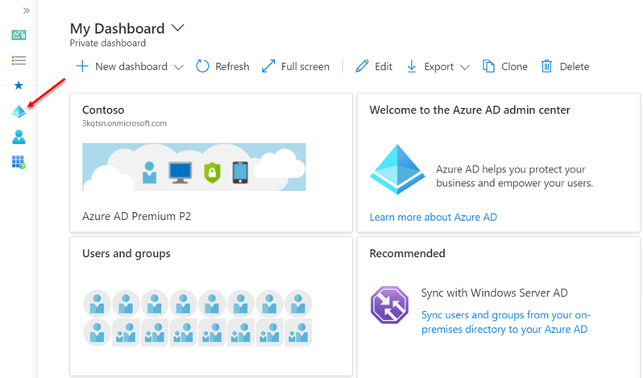
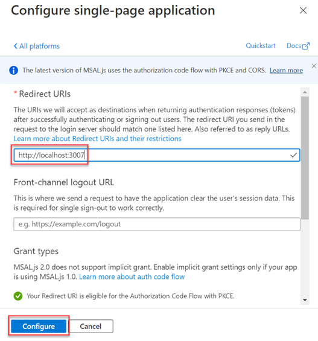

# Exercise 1: Different types of tokens used in Microsoft identity

In this exercise, you'll create an Azure AD application and single page application for a user to sign in and display their information on the page.

## Task 1: Create a Node.js web application

> [!NOTE]
> The instructions below assume you are using v2.23.0 of the Microsoft Authentication Library for JavaScript 2.0.

1. Open your command prompt, navigate to a directory where you want to save your work, create a new folder, and change directory into that folder.

2. Execute the following command to create a new Node.js application:

```shell
npm init -y
```

3. Install the Node.js webserver **express** and HTTP request middleware **morgan** into the application:

```shell
npm install express morgan
```

4. Open the application in Visual Studio Code using the following command:

```console
code .
```
If a message pop-ups **Do you trust the authors of the files in the folder?** check the **Trust the authors of all files in the parent folder <created on the step #1>**  and click the **Yes, I trust the authors**

5. Create a new file **server.js** in the root of the folder and add the following JavaScript to it. This code will start the web server:

```js
var express = require('express');
var app = express();
var morgan = require('morgan');
var path = require('path');

var port = 3007;
app.use(morgan('dev'));

// set the front-end folder to serve public assets.
app.use(express.static('web'));

// set up our one route to the index.html file.
app.get('*', function (req, res) {
  res.sendFile(path.join(__dirname + '/index.html'));
});

// Start the server.
app.listen(port);
console.log(`Listening on port ${port}...`);
console.log('Press CTRL+C to stop the web server...');
```

## Task 2: Create a web page for the user to sign in and display details

1. Add a new file **index.html** to the folder. Add the following code to the **index.html** file:

```html
<!DOCTYPE html>
<html>
<head>
  <title>Getting Started with Microsoft identity</title>
  <script src="https://cdnjs.cloudflare.com/ajax/libs/bluebird/3.7.2/bluebird.min.js"></script>
  <script src="https://alcdn.msauth.net/browser/2.23.0/js/msal-browser.js"></script>
</head>

<body>
  <div class="container">
    <div>
      <p id="WelcomeMessage">Microsoft Authentication Library For Javascript (MSAL.js) Exercise</p>
      <button id="SignIn" onclick="signIn()">Sign In</button>
    </div>
    <div>
      <pre id="json"></pre>
    </div>
  </div>
  <script>
    var ua = window.navigator.userAgent;
    var msie = ua.indexOf('MSIE ');
    var msie11 = ua.indexOf('Trident/');
    var msedge = ua.indexOf('Edge/');
    var isIE = msie > 0 || msie11 > 0;
    var isEdge = msedge > 0;

    var msalConfig = {
      auth: {
        clientId: '',
        authority: '',
        redirectURI: ''
      },
      cache: {
        cacheLocation: "localStorage",
        storeAuthStateInCookie: isIE || isEdge
      }
    };

    var graphConfig = {
      graphMeEndpoint: "https://graph.microsoft.com/v1.0/me",
      requestObj: {
        scopes: ["user.read"]
      }
    };

    var msalApplication = new msal.PublicClientApplication(msalConfig);
    var userName = "";
    var loginType = isIE ? "REDIRECT" : "POPUP";


    // TODO: add CODE before this line


    // TODO: add FUNCTIONS before this line
  </script>
</body>
</html>
```

> [!NOTE]
> The remainder of this exercise instructs you to add code to this **index.html** file. Pay close attention where you add the code using the two `TODO:` comments for placement.

2. Add the following function to the **index.html** file immediately before the `// TODO: add FUNCTIONS before this line` comment that will configure the welcome message for the page:

```js
function updateUserInterface() {
  var divWelcome = document.getElementById('WelcomeMessage');
  divWelcome.innerHTML = 'Welcome <strong>' + userName + '</strong> to Microsoft Graph API';

  var loginbutton = document.getElementById('SignIn');
  loginbutton.innerHTML = 'Sign Out';
  loginbutton.setAttribute('onclick', 'signOut();');
}
```

3. Next, add the following function to **index.html** immediately before the `// TODO: add FUNCTIONS before this line` comment. This function requests an access token from Microsoft identity and submits a request to Microsoft Graph for the current user's information. The function uses the popup approach for modern browsers:

```js
function acquireTokenAndGetUser() {
  var request = graphConfig.requestObj;
  request.account = msalApplication.getAccountByUsername(userName);

  msalApplication.acquireTokenSilent(request)
    .then(function (tokenResponse) {
      getUserFromMSGraph(tokenResponse.accessToken, graphAPICallback);
    })
    .catch(function (error) {
      console.log("silent token acquisition fails.");
      if (error instanceof msal.InteractionRequiredAuthError) {
        if (loginType == "POPUP") {
          msalApplication.acquireTokenPopup(request)
            .then(function (tokenResponse) {
              getUserFromMSGraph(tokenResponse.accessToken, graphAPICallback);
            })
            .catch(function (error) { console.error(error); }
            );
        } else {
          msalApplication.acquireTokenRedirect(request);
        }
      } else {
        console.error(error);
      }
    });
}
```

The function first attempts to retrieve the access token silently from the currently signed in user. If the user needs to sign in, the function will trigger either the popup or redirect authentication process.

The redirect approach to authenticating requires an extra step. The MSAL application on the page needs to see if the current page was requested based on a redirect from Azure AD. If so, it needs to process information in the URL request provided by Azure AD.

4. Add the following code immediately before the `// TODO: add CODE before this line` comment:

```js
msalApplication.handleRedirectPromise()
  .then(handleResponse)
  .catch(function (error) { console.log(error); }
  );
```

Once the user is authenticated, the code can submit a request to Microsoft Graph for the current user's information. The `acquireTokenAndGetUser()` function passes the access token acquired from Azure AD to the `getUserFromMSGraph()` function you are about to add.

5. Add the following functions immediately before the `// TODO: add FUNCTIONS before this line` comment:

```js
function getUserFromMSGraph(accessToken, callback) {
  var endpoint = graphConfig.graphMeEndpoint;

  var xmlHttp = new XMLHttpRequest();
  xmlHttp.onreadystatechange = function () {
    if (this.readyState == 4 && this.status == 200)
      callback(JSON.parse(this.responseText));
  }
  xmlHttp.open("GET", endpoint, true);
  xmlHttp.setRequestHeader('Authorization', 'Bearer ' + accessToken);
  xmlHttp.send();
}

function graphAPICallback(data) {
  document.getElementById("json").innerHTML = JSON.stringify(data, null, 2);
}
```

Finally, add the following functions to implement a sign in and sign out capability for the button on the page.

6. Add the functions immediately before the `// TODO: add FUNCTIONS before this line` comment:

```js
function handleResponse(loginResponse) {
  if (loginResponse != null) {
    userName = loginResponse.account.username;
  } else {
    var currentAccounts = msalApplication.getAllAccounts();
    if (currentAccounts == null || currentAccounts.length == 0) {
      return;
    } else {
      userName = currentAccounts[0].username;
    }
  }

  updateUserInterface();
  acquireTokenAndGetUser();
}

function signIn() {
  if (loginType == "POPUP") {
    msalApplication.loginPopup(graphConfig.requestObj)
      .then(handleResponse)
      .catch(function (error) { console.log(error); }
      );
  } else {
    msalApplication.loginRedirect(graphConfig.requestObj);
  }
}

function signOut() {
  var logoutRequest = {
    account: msalApplication.getAccountByUsername(userName)
  };

  msalApplication.logout(logoutRequest);
}
```

## Task 3: Create an Azure AD application

The web page you created will submit a request to Microsoft Graph to retrieve the user's details. All requests to Microsoft Graph must include an access token as proof of the user's identity and that they have the necessary permissions to call Microsoft Graph. To obtain an access token, you must create an Azure AD application.

1. Open a browser and navigate to the [Azure Active Directory admin center](https://aad.portal.azure.com). Sign in using a **Work or School Account** that has global administrator rights to the tenancy.

2. Select **Azure Active Directory** in the left-hand navigation.

  

3. Select **Manage > App registrations** in the left-hand navigation.

4. On the **App registrations** page, select **+ New registration**.

  

5. On the **Register an application** page, set the values as follows:

- **Name**: Hello World Identity
- **Supported account types**: Accounts in this organizational directory only (Single tenant)

    

6. Select **Register** to create the application.

7. On the **Hello World Identity** page, copy the values **Application (client) ID** and **Directory (tenant) ID**; you'll need these values later in this exercise.

  

8. Select **Manage > Authentication** in the left-hand navigation.

9. On the **Authentication** page, select **+ Add a platform**. When the **Configure platforms** panel appears, select **Single-page application**.


10. In the **Configure single-page application** panel, add **http://localhost:3007** under **Redirect URIs**, and select **Configure**.



## Task 4: Update the web page with the Azure AD application details

The last step is to configure the web page to use the Azure AD application.

1. Locate the `var msalConfig = {}` code in the **index.html** file. The `auth` object contains three properties you need to set as follows:

- `clientId`: set to the Azure AD application's ID
- `authority`: set to **https://login.microsoftonline.com/{{DIRECTORY_ID}}**, replacing the **{{DIRECTORY_ID}}** with the Azure AD directory ID of the Azure AD application
- `redirectURI`: set to the Azure AD application's redirect URI: **http://localhost:3007**

## Task 5: Test the web application

1. To test the web page, first start the local web server. In the command prompt, execute the following command from the root of the project:

```shell
node server.js
```

2. Next, open a browser and navigate to http://localhost:3007. The page initially contains a default welcome message and sign in button.


3. Select the **sign in** button.

Depending on the browser you are using, a popup window will load or the page will redirect to the Azure AD sign in prompt.

4. Sign in using a **Work or School Account** and accept the permissions requested for the application by selecting **Accept**


5. Depending on the browser you're using, the popup will disappear or you will be redirected back to the web page. When the page loads, MSAL will request an access token and request your information from Microsoft Graph. After the request complete, it will display the results on the page:


6. Stop the local web server by pressing <kbd>CTRL</kbd>+<kbd>C</kbd> in the console.

## Summary

In this exercise, you created an Azure AD application and single page application for a user to sign in and display their information on the page.
