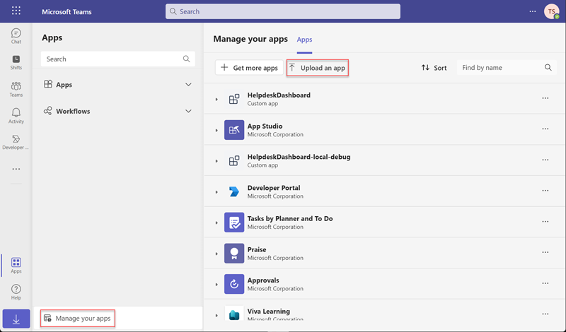
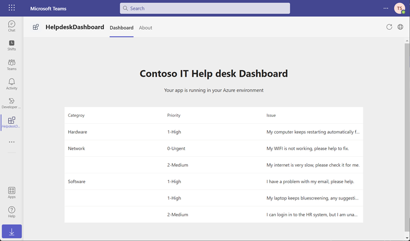
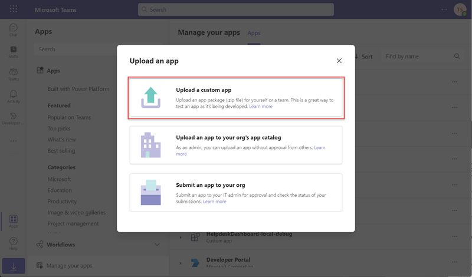
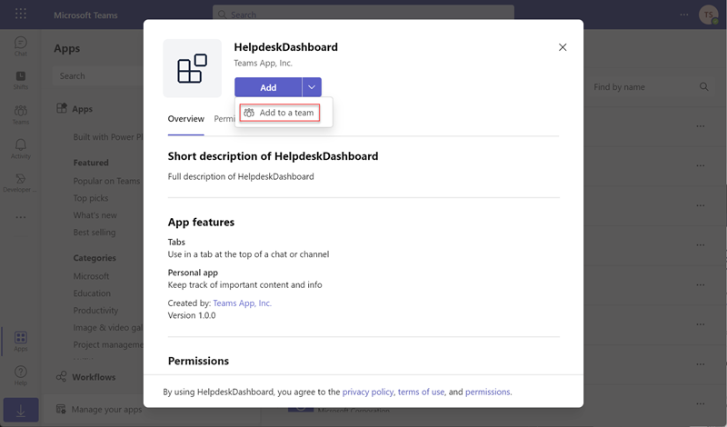
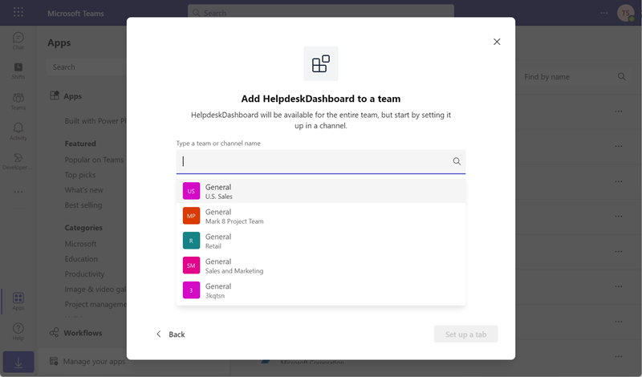
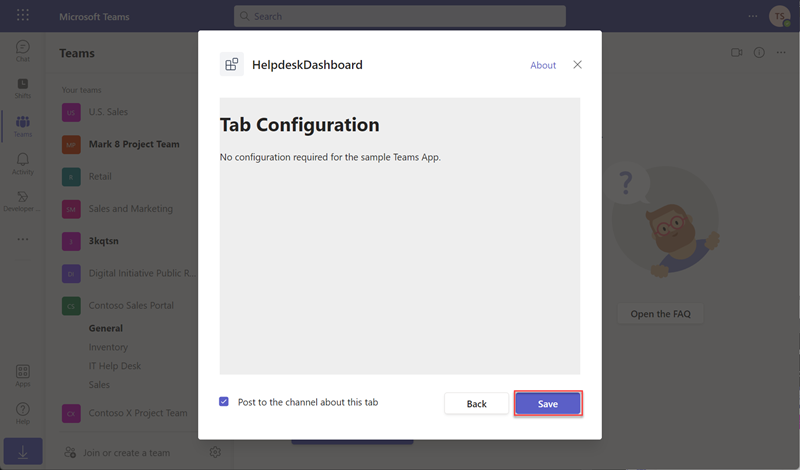
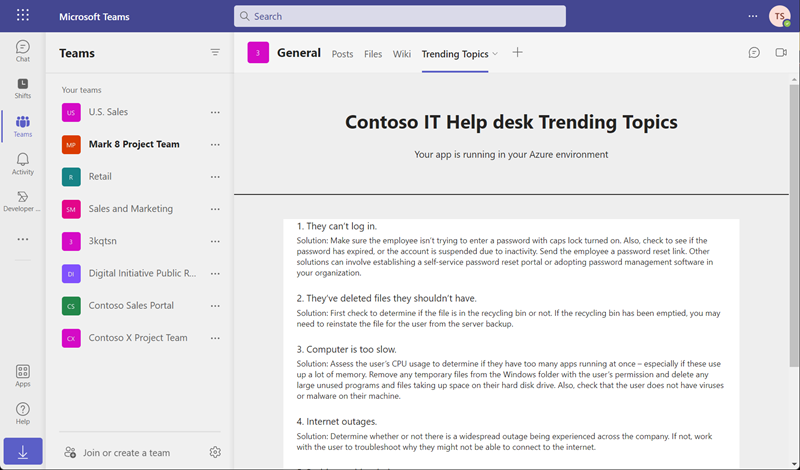

# Exercise 2: Upload an app to a user or team

In this exercise, you will use the TeamsFx CLI to deploy cloud resources, package a custom Teams App, and then upload the App to Teams for a single user and a team, respectively.

## Prerequisites
- A Microsoft 365 tenant.
    > [!NOTE]
    > Follow the instructions on [Welcome to the Microsoft 365 Developer Program](https://docs.microsoft.com/en-us/office/developer-program/microsoft-365-developer-program) for obtaining a developer tenant if you don't currently have a Microsoft 365 account. Make sure you have also enabled Microsoft Teams.
- An Azure subscription.
    > [!NOTE]
    > If you don't currently have an Azure account, you can create [a free Azure account](https://azure.microsoft.com/free/) before you start.
- [Node.js](https://nodejs.org/) - (v16.\* is recommended or higher)
- [TeamsFx CLI](https://www.npmjs.com/package/@microsoft/teamsfx-cli) - (v1.\* is recommended or higher)
- [Bicep](https://github.com/Azure/bicep/releases/latest/download/bicep-setup-win-x64.exe) - (v0.4 is recommended or higher)

## Task 1: Create a Microsoft Teams app package

1. Copy the **Helpdesk-Upload-App** folder to your local workstation from the Allfiles folder.

1. Open a Command Prompt with Administrative privileges.

1. From the command line, change the directory to the **Helpdesk-Upload-App** folder you copied to your local machine.

1. Execute the command below to log in to Microsoft 365.

    ```powershell
    teamsfx account login m365
    ```
1. Execute the command below to log in to Microsoft Azure.
    > [!NOTE]
    > If you have multiple Microsoft Azure subscriptions, execute this command `teamsfx account set --subscription <Subscription ID>` to select the subscription you will use for testing.

    ```powershell
    teamsfx account login azure
    ```
1. Execute the command below to provision the cloud resources.

    ```powershell
    teamsfx provision
    ```
    Enter the following values when prompted:

    - **? Select a resource group:** *+ New resource group*
    - **? New resource group name:** *helpdesk_dashboard-dev-rg*
    - **? Location for the new resource group:** *East US*
    - **? Do you want to provision resources in dev environment?** *Yes* 

    <br/>
1. Execute the command below to deploy the application.

     ```powershell
    teamsfx deploy
    ```

    Enter the following values when prompted:

    - **? Whether to deploy aad manifest:** *no*
    - **? Whether to deploy app manifest to Teams platform:** *no*
    - **? Do you want to deploy resources in dev environment?** *yes*

    <br/>
1. Execute the command below to build your Teams app into a package.

     ```powershell
    teamsfx package
    ```

    Enter the following values when prompted:

    - **? Select an environment:** *dev*

    <br/>

    When the command is executed successfully, an app package (.zip file) is created in the **/Helpdesk-Upload-App/build/appPackage/** folder. You will need this zip file later.

## Task 2: Upload the custom app for a single user

Personal tabs, along with personally-scoped bots, are part of personal apps and are scoped to a single user. They can be pinned to the left pane for easy access. 

1. Go to Microsoft Teams and select **Apps**.

    

1. Select **Manage your apps** \> **Upload an app** \> **Upload a custom app** to upload your packaged zip file.

    

1. Select **Add** in the dialog. the app is uploaded to Teams.

    

Now you have successfully added the custom app for a single user.



## Taask 3: Upload the custom app to a team

Channel and group tabs deliver content to channels and group chats.  They are a great way to create collaborative spaces around dedicated web-based content.

1. Go to Microsoft Teams and select **Apps**.

    

1. Select **Manage your apps** \> **Upload an app** \> **Upload a custom app** to upload your packaged zip file.

    

    

1. Select the chevron down icon to the right of the **Add** button in the dialog. 

    

1. A Team picklist box will pop up, select a test Team channel, then select **Set up a tab**.

    

1. In configuration page, select **Save** and your tab is added to the channel's tab bar.

    

Now you have successfully added the custom Teams app to a team.



## Summary

In this exercise, you added a custom Teams App for a single user and a Team.