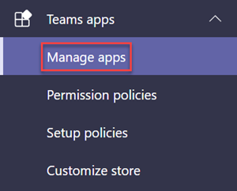
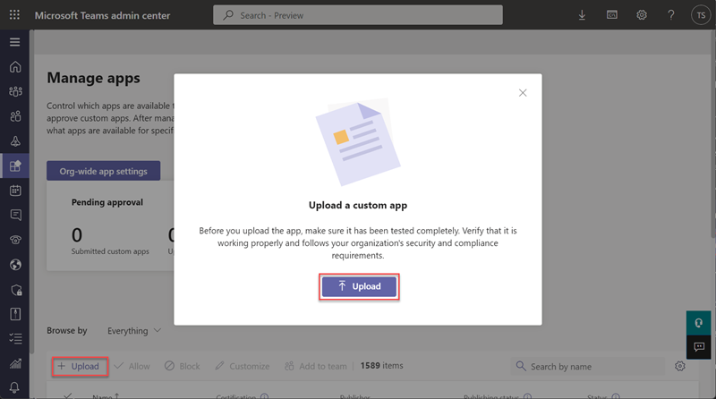
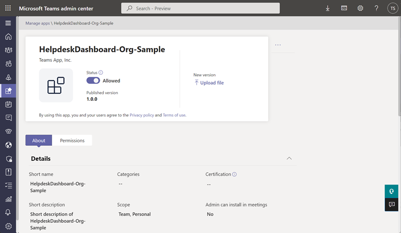
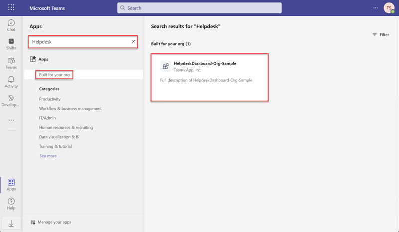
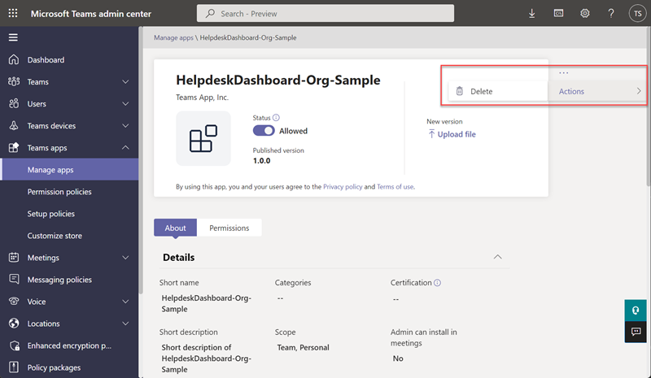
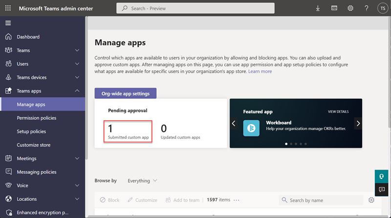
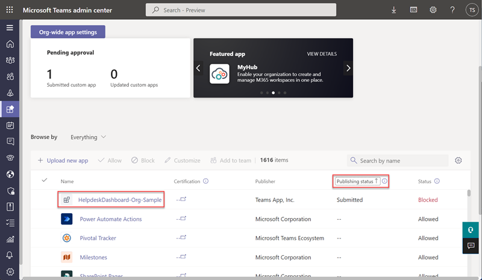
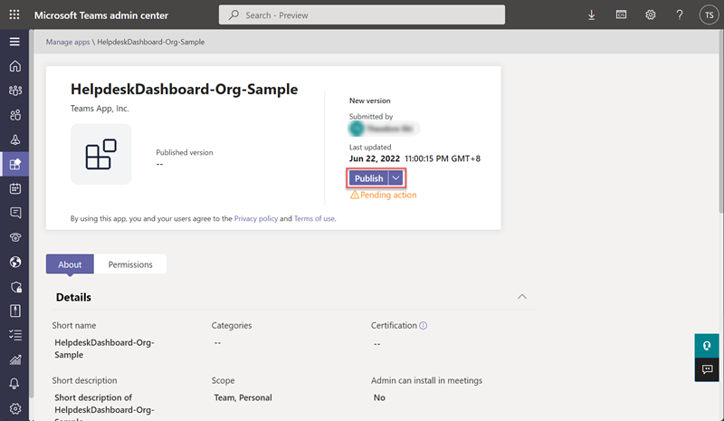

# Exercise 3: Publish an app to your organization

In this exercise, you will use the TeamsFx CLI to deploy cloud resources, package a custom Teams App, and then publish the custom app to your organization.

## Prerequisites

- A Microsoft 365 tenant.
    > [!NOTE]
    > Follow the instructions on [Welcome to the Microsoft 365 Developer Program](https://docs.microsoft.com/en-us/office/developer-program/microsoft-365-developer-program) for obtaining a developer tenant if you don't currently have a Microsoft 365 account. Make sure you have also enabled Microsoft Teams.
- An Azure subscription.
    > [!NOTE]
    > If you don't currently have an Azure account, you can create [a free Azure account](https://azure.microsoft.com/free/) before you start.
- [Node.js](https://nodejs.org/) - (v16.\* is recommended or higher)
- [TeamsFx CLI](https://www.npmjs.com/package/@microsoft/teamsfx-cli) - (v1.\* is recommended or higher)
- [Bicep](https://github.com/Azure/bicep/releases/latest/download/bicep-setup-win-x64.exe) - (v0.4 is recommended or higher)

## Task 1: Create a Microsoft Teams app package

1. Copy the **Helpdesk-Publish-App** folder to your local workstation.

1. Open a Command Prompt with Administrative privileges.

1. From the command line, change the directory to the **Helpdesk-Publish-App** folder you copied to your local machine.

1. Execute the command below to log in to Microsoft 365.

    ```powershell
    teamsfx account login m365
    ```
1. Execute the command below to log in to Microsoft Azure.
    > [!NOTE]
    > If you have multiple Microsoft Azure subscriptions, execute this command `teamsfx account set --subscription <Subscription ID>` to select the subscription you use for testing.

    ```powershell
    teamsfx account login azure
    ```
1. Execute the command below to provision the cloud resources.

    ```powershell
    teamsfx provision
    ```

    Enter the following values when prompted:

    - **? Select a resource group:** *+ New resource group*
    - **? New resource group name:** *helpdesk_dashboard_org_dev-rg*
    - **? Location for the new resource group:** *East US*
    - **? Do you want to provision resources in dev environment?** *Yes* 

    <br/>
1. Execute the command below to deploy the current application.

    ```powershell
    teamsfx deploy
    ```

    Enter the following values when prompted:

    - **? Whether to deploy aad manifest:** *no*
    - **? Whether to deploy app manifest to Teams platform:** *no*
    - **? Do you want to deploy resources in dev environment?** *yes*

    <br/>
1. Execute the command below to build your Teams app into a package.

    ```powershell
    teamsfx package
    ```

    Enter the following values when prompted:

    - **? Select an environment:** *dev*

    <br/>

    When the command is executed successfully, an app package (.zip file) is created in the **/Helpdesk-Publish-App/build/appPackage/** folder. You will need this zip file later.

## Task 2: Publish a custom app to your organization's app store

Use the Manage apps page to publish apps that are built specifically for your organization. After you publish a custom app, it's available to users in your organization's app store. There are two ways to publish a custom app to your organization's app store.  This exercise demonstrates both.

### Upload an app package

1. Open a browser and navigate to the [Microsoft Teams admin center](https://admin.teams.microsoft.com/). Sign in using a **Work or School Account** that is a Global Admin or Teams Service Admin.

1. In the left navigation of the Microsoft Teams admin center, go to **Teams apps** > **Manage apps**.

    

1. Select **Upload**, click **Upload**, select the app package that you made earlier, and select **Open**.

    

1. After the upload is complete, the page jumps to the details page of the custom app.

    

1. Open a new tab in your browser, navigate to [Microsoft Teams](https://teams.microsoft.com/) and select **Apps** in left sidebar.

    

1. Enter **Helpdesk** in search box, and select **Built for your org**, you should be able to find the custom Teams app you published.

    

Now, the custom Teams app is available to users in your organization's app store. 

### Approve a custom app

Before starting the following steps, you need to delete the custom app you published in the previous section.  To do this, go to the App detail page in the **Microsoft Teams admin center**.  Then, select **Actions** > **Delete**.



1. Open a Command Prompt with Administrative privileges.

1. From the command line, change the directory to the **Helpdesk-Publish-App** folder you copied to your local machine.

1. Execute the command below to publish your custom app to your organization.

    ```powershell
    teamsfx publish
    ```

1. Open a browser and navigate to the [Microsoft Teams admin center](https://admin.teams.microsoft.com/). Sign in using a **Work or School Account** that is a Global Admin or Teams Service Admin.

1. In the left navigation of the Microsoft Teams admin center, go to **Teams apps** > **Manage apps**.

    

1. Observe that the app you just submitted is now in the **Pending Approval** panel.

    

1. In apps table, click the **Publishing status** column header to sort.  Then click the app you submitted.

    

1. Select **Publish** to approve the custom app.

    

1. Open a new tab in your browser, navigate to [Microsoft Teams](https://teams.microsoft.com/) and select **Apps** in left sidebar.

    

1. Enter **Helpdesk** in the search box, and select **Built for your org**. You should be able to find the custom Teams app you published.

    

Now, the custom Teams app is available to users in your organization's app store. 

## Summary

In this exercise, you published a custom app to your organization in 2 ways.