# Exercise 1: Manage apps in the Developer Portal

In this exercise, you will use Developer Portal to modify the app manifest of a custom Teams app to add a new personal tab.  

## Scenario

The sample application is a service bot and ticket dashboard for an IT Help Desk.  Customers use Teams channels to interact with a bot to create help desk tickets.  The bot asks for the category, priority, and description of each issue.  The bot creates tickets and stores the data in Dataverse.

To improve the service efficiency of the IT Helpdesk, the IT Helpdesk wants to create a Trending Topics page to help customers solve some of the most common issues.

## Prerequisites

To complete this lab exercise, you will need:

- A Microsoft 365 tenant.
    > [!NOTE]
    > Follow the instructions on [Welcome to the Microsoft 365 Developer Program](https://docs.microsoft.com/en-us/office/developer-program/microsoft-365-developer-program) for obtaining a developer tenant if you don't currently have a Microsoft 365 account. Make sure you have also enabled Microsoft Teams.
- [Node.js](https://nodejs.org/) - (v16.\* is recommended or higher)
- [Visual Studio Code](https://code.visualstudio.com)
- [Teams Toolkit for Visual Studio Code](https://marketplace.visualstudio.com/items?itemName=TeamsDevApp.ms-teams-vscode-extension) - (4.\* or higher)

## Task 1: Update code to add a Trending Topic page

1. Copy the **Helpdesk-Modify-Definition** folder to your local workstation from the Allfiles folder.

1. Open Visual Studio Code.

1. Select the Teams Toolkit icon in the sidebar.

    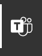

1. Select **Open folder** in the Teams Toolkit pane on the left.

    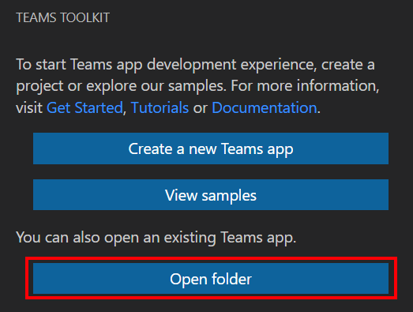

1. Open the **Helpdesk-Modify-Definition** folder you just copied to your local machine.

1. Under the **./tabs/src/components** folder, create a new React component named **TrendingTab.tsx** and add the follow code to it:

    ```tsx
    import { useContext } from "react";
    import { TeamsFxContext } from "./Context";
    import { Divider, List, Provider } from "@fluentui/react-northstar";

    export default function TrendingTab(props: { environment?: string }) {
        const { themeString } = useContext(TeamsFxContext);

        const items = [
            {
            header: '1. They can’t log in.',
            content: 'Solution: Make sure the employee isn’t trying to enter a password with caps lock turned on. Also, check to see if the password has expired, or the account is suspended due to inactivity. Send the employee a password reset link. Other solutions can involve establishing a self-service password reset portal or adopting password management software in your organization.',
            },
            {
            header: '2. They’ve deleted files they shouldn’t have.',
            content: 'Solution: First check to determine if the file is in the recycling bin or not. If the recycling bin has been emptied, you may need to reinstate the file for the user from the server backup.',
            },
            {
            header: '3. Computer is too slow.',
            content: 'Solution: Assess the user’s CPU usage to determine if they have too many apps running at once – especially if these use up a lot of memory. Remove any temporary files from the Windows folder with the user’s permission and delete any large unused programs and files taking up space on their hard disk drive. Also, check that the user does not have viruses or malware on their machine.',
            },
            {
            header: '4. Internet outages.',
            content: 'Solution: Determine whether or not there is a widespread outage being experienced across the company. If not, work with the user to troubleshoot why they might not be able to connect to the internet.',
            },
            {
            header: '5. Problems with printing.',
            content: 'Solution: Identify the specific issue. Get the user to check the printer is turned on and that the printer is showing up for them to print to. They may need to add a specific network printer in their settings. For other issues such as paper jams, talk them through the instructions from the manufacturer relevant to the specific machine.',
            },
            {
            header: '6. User has lost access to the shared drive.',
            content: 'Solution: Ping the server to see that the user is able to connect with it. Then you will have to help them to remap their network drives so they can access them once more.',
            },
        ]

        const { environment } = {
            environment: window.location.hostname === "localhost" ? "local" : "azure",
            ...props,
        };
        const friendlyEnvironmentName =
        {
            local: "local environment",
            azure: "Azure environment",
        }[environment] || "local environment";

        const { teamsfx } = useContext(TeamsFxContext);

        return (
            <div className={themeString === "default" ? "" : "dark"}>
                <div className="welcome page">
                    <div className="narrow page-padding">
                        <h1 className="center">Contoso IT Help Desk Trending Topics</h1>
                        <p className="center">Your app is running in your {friendlyEnvironmentName}</p>
                    </div>
                    <Divider color="grey" />
                    <div className="narrow page-padding">
                        <Provider>
                            <List items={items}  />
                        </Provider>
                    </div>
                </div>
            </div>
        );
    }
    ```

    > [!NOTE] 
    > In this code sample, we hardcoded the trending topic sample data to keep the exercise simple.  In a real production scenario, this data would most likely be stored in a database.

1. Locate and open the file **./src/components/App.tsx**.

1. Add the `import` statements in this file to add the TrendingTab component.

    ```tsx
    import TrendingTab from "./TrendingTab";
    ```
1. Locate the `Router` statement, and replace it with the following code to add a route for the Trending Topics page.

    ```tsx
    <Router>
        <Route exact path="/">
        <Redirect to="/dashboard" />
        </Route>
        {loading ? (
        <Loader style={{ margin: 100 }} />
        ) : (
        <>
            <Route exact path="/privacy" component={Privacy} />
            <Route exact path="/termsofuse" component={TermsOfUse} />
            <Route exact path="/dashboard" component={DashboardTab} />
            <Route exact path="/config" component={TabConfig} />
            <Route exact path="/trending" component={TrendingTab} />
        </>
        )}
    </Router>
    ```

## Task 2: Install sample Teams Tab App

### Sign in to your Microsoft 365 account

You can skip the steps below if you are already signed in to your Microsoft 365 account in the **Teams Toolkit**.

1. From Visual Studio Code, select the Teams Toolkit icon in the sidebar.

1. Select **Sign in to M365**. 

    Your default web browser opens to let you sign in to the account.

1. Sign in to your Microsoft 365 account using your credentials.

1. Close the browser when prompted, and return to Visual Studio Code.

1. Return to the Teams Toolkit within Visual Studio Code.

    The **ACCOUNTS** section of the sidebar shows your Microsoft 365 account name. The Teams Toolkit displays **Sideloading enabled** if sideloading is enabled for your Microsoft 365 account.

    

### Build and run your app locally in Visual Studio Code

To build and run your app locally:

1. From Visual Studio Code, press **F5** to run the application in debug mode.

    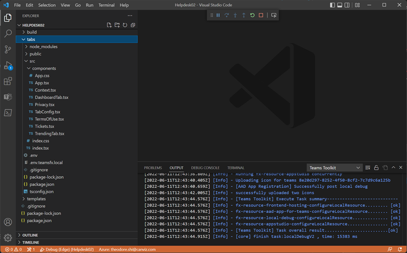

    > [!NOTE]
    > When you run the app for the first time, all dependencies are downloaded and the app is built. A browser window opens when the build is complete. This process can take 3-5 minutes to complete.

    The toolkit prompts you to install a local certificate, if necessary. This certificate allows Teams to load your application from https://localhost.

1. Select **Yes** if the following dialog appears:

    

1. If prompted, sign in with your Microsoft 365 account.

1. Select **Add** when prompted to sideload the app onto Teams on your local machine.

    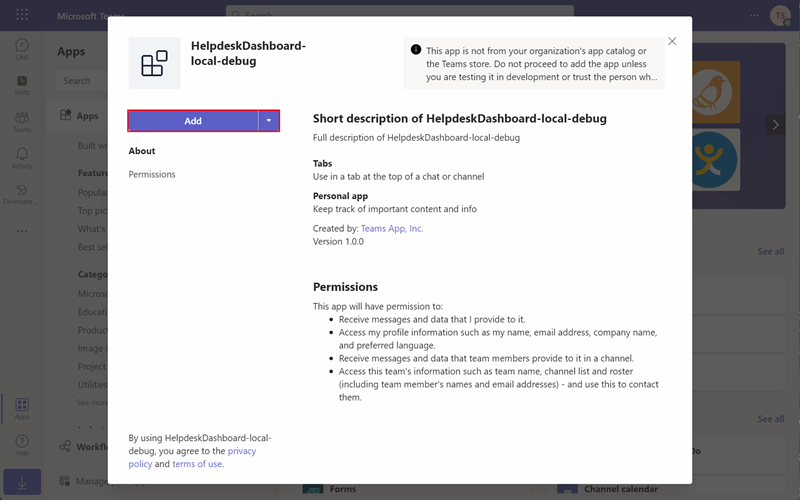

1. Keep the Debug state in Visual Studio Code and don't close the Teams page, we will use it later.

## Task 3: Modify the app manifest in the Developer Portal

The Developer Portal for Teams is the primary tool for configuring, distributing, and managing your Microsoft Teams apps. With the Developer Portal, you can collaborate with colleagues on your app, set up runtime environments, and much more.

1. Open a browser and navigate to the [Developer Portal](https://dev.teams.microsoft.com/apps).
        
1. In the **Apps** page, select the **HelpdeskDashboard-local-debug** app you just installed.

    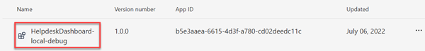

1. Under **Configure** ,select **App features**.  Then, select **Personal app**.

    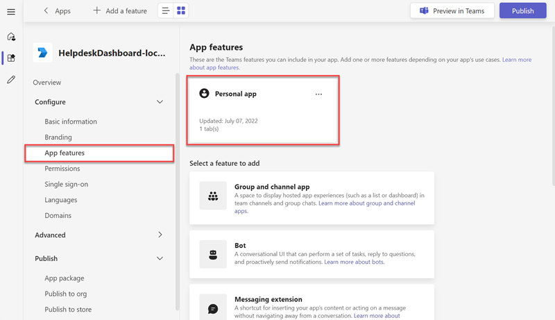

1. Select **+ Add a personal tab**.

    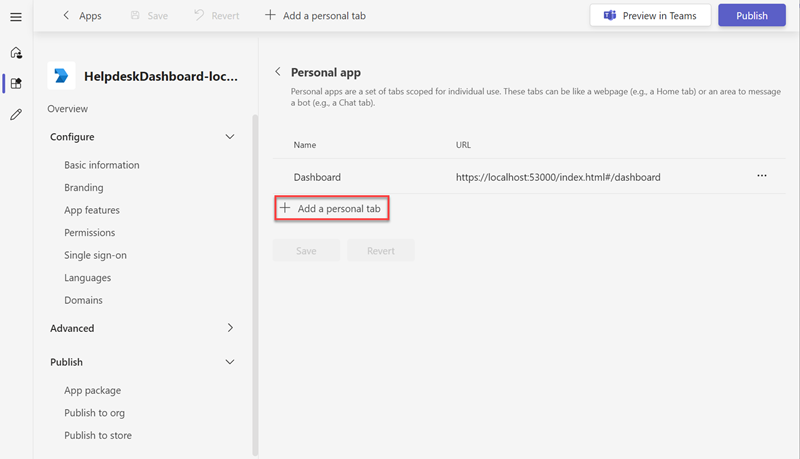

1. In the **Add a tab to your personal app** popup box, enter the following values and then select **Add**:

    - **Name**: *Trending Topics*
    - **Content URL**: *https://localhost:53000/#/trending*

    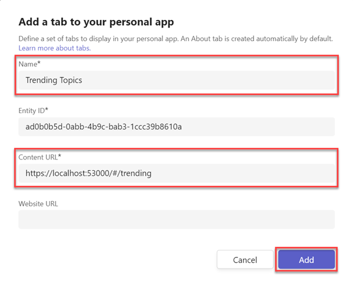

1. Select **Save**.

    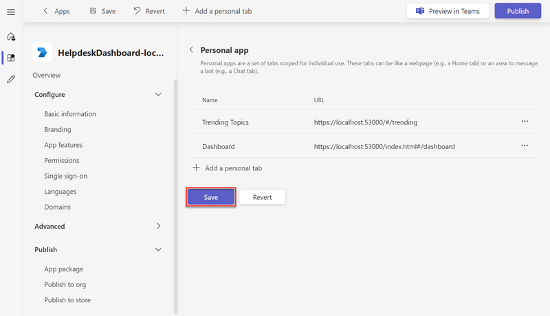

1. After the personal tab is updated successfully, select **Preview in Teams**.

    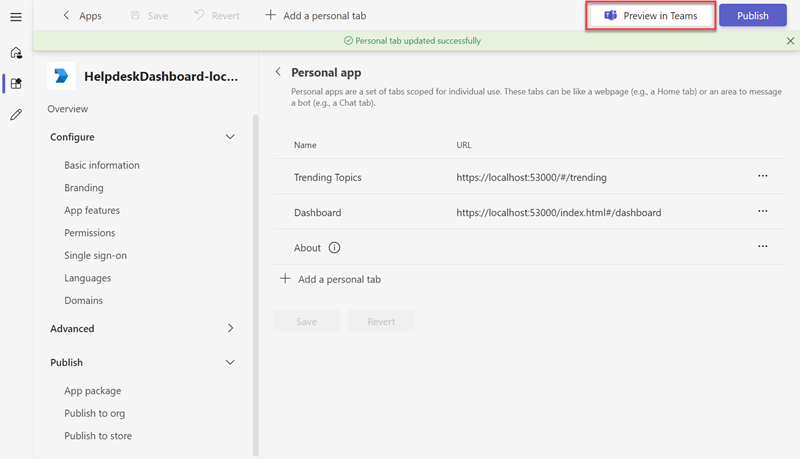

1. After clicking **Preview in Teams**, a new tab will open in your browser, select **Use the web app instead**.

    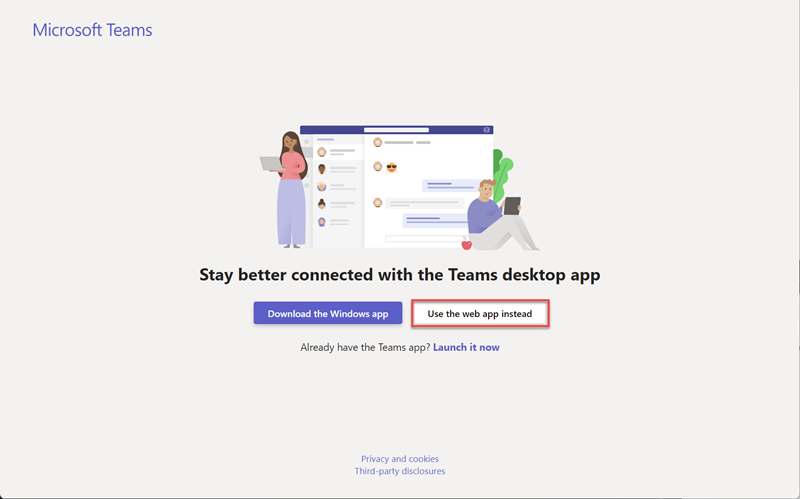

1. Select **Add**.

    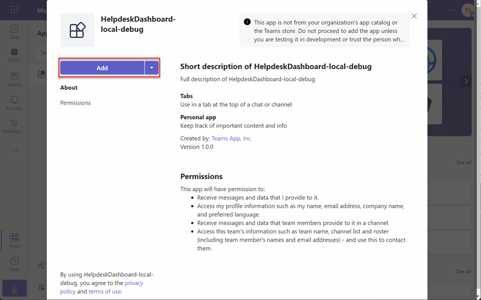

1. Observe the Trending Topics Personal Tab you added.

    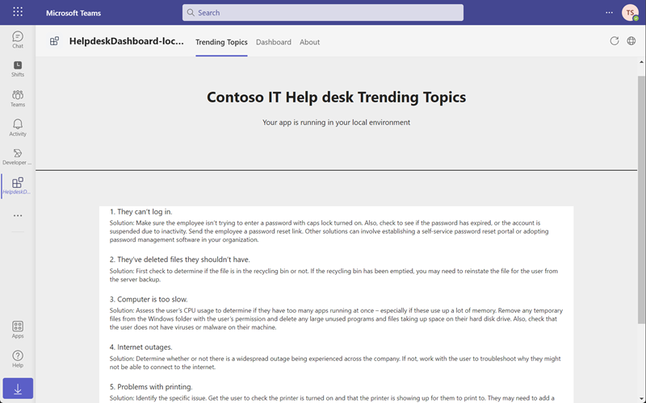

## Summary

In this exercise, you used the Developer Portal to create a personal tab for a custom Teams app.