# Exercise 4: Automate app deployment

In this exercise, we will use the TeamsFx to automate development workflow while building a custom Teams application. 

## Prerequisites

- A Microsoft 365 tenant
    > [!NOTE]
    > Follow the instructions on [Welcome to the Microsoft 365 Developer Program](https://docs.microsoft.com/en-us/office/developer-program/microsoft-365-developer-program) for obtaining a developer tenant if you don't currently have a Microsoft 365 account. Make sure you have also enabled Microsoft Teams.
- A Microsoft 365 account without MFA
    > [!NOTE] 
    > Currently, a non-interactive authentication style for M365 is used in CI/CD workflows, so please ensure that your M365 account has sufficient privileges in your tenant and doesn't have multi-factor authentication or other advanced security features enabled. Please refer to the Configure M365 Credentials to make sure you have disabled Multi-factor Authentication and Security Defaults for the credentials used in the workflow.
- An Azure subscription
    > [!NOTE]
    > If you don't currently have an Azure account, you can create [a free Azure account](https://azure.microsoft.com/free/).
- A test repository on Azure DevOps
    > [!NOTE]
    >  If you don't currently have a test repository on Azure DevOps, you can [create one for free](https://azure.microsoft.com/en-us/services/devops/), and make sure you have [enabled scripts to run Git commands](https://docs.microsoft.com/en-us/azure/devops/pipelines/scripts/git-commands?view=azure-devops&tabs=yaml#enable-scripts-to-run-git-commands).
    
- [Node.js](https://nodejs.org/) - (v16.\* is recommended or higher)
- [Git](https://git-scm.com/downloads)
- [Azure CLI](https://docs.microsoft.com/en-us/cli/azure/install-azure-cli)
- [TeamsFx CLI](https://www.npmjs.com/package/@microsoft/teamsfx-cli) - (v1.\* is recommended or higher)
- [Bicep](https://github.com/Azure/bicep/releases/latest/download/bicep-setup-win-x64.exe) - (v0.4 is recommended or higher)

- [Visual Studio Code](https://code.visualstudio.com)

## Task 1: Add project source code to Azure DevOps

1. Create a new folder named **CICDSample** on your local machine.

1. Open a Command Prompt with Administrative privileges.

1. From the command line, change the directory to the **CICDSample** folder you created.

1. Execute the command below to clone your test repository to your local machine.

    > [Tips]
    > Git URLs in Azure DevOps usually look like this: https://dev.azure.com/{organization}/{project}/_git/{repository} .

    ```Power
    git clone https://dev.azure.com/{organization}/{project}/_git/{repository}
    ```

1. If prompted, sign in with your Azure DevOps account in the **Git Credential Manager**.

1. From the **Allfiles** folder, copy everything in the **Helpdesk-CICD** folder to the **./CICDSample/{repository}** folder.

1. From the command line, change the directory to the **./CICDSample/{repository}/** folder.

1. Execute the `npm install` command to install the required packages.

1. Execute the `teamsfx add cicd` command to start the interactive command process.

    1. Select **Azure DevOps** as the CI/CD provider.

    1. Select the templates below from these options: **CI**, **CD**, **Provision**, and **Publish to Teams**.
        - CD
        - Provision
        - Publish to Teams

1. Open Visual Studio Code, then locate and open the **./.azure/pipelines/cd.dev.yml** file.

1. Locate the statement `- main`.

1. Replace `main` with `master`.

1. Save the file and close Visual Studio Code.

1. Execute the commands below to commit and push your project source code to the Azure DevOps remote repository, including the CI/CD yml files.

    > [!NOTE] 
    > Before you can issue a commit in Git, the `user.name` and `user.email` properties must be set. If not, please execute the commands below: <br/>
    > `git config --global user.email "you@example.com"` <br/>
    > `git config --global user.name "Your Name"`

    ```powershell
    git add .
    git commit -a -m "init"
    git push --force origin master
    git branch --set-upstream-to=origin/master
    ```

## Task 2: Create Azure Service Principals

To provision and deploy resources targeting Azure inside CI/CD, you must create an Azure service principal for use.

1. From the command line, execute the command below to log in to the tenant where you want to provision cloud resources.

    ```powershell
    az login --tenant <tenantId>
    ```

1. Execute the command below to create an Azure service principal.

    ```powershell
    az ad sp create-for-rbac --name myCICDServicePrincipal --role Contributor --scopes /subscriptions/<subscriptionId>
    ```

1. After the Azure service principal is created successfully, copy the tenant (AZURE_TENANT_ID), appId (AZURE_SERVICE_PRINCIPAL_NAME) and the password (AZURE_SERVICE_PRINCIPAL_PASSWORD) from the output to a text file. You will need these values later.

## Task 3: Create Azure DevOps Pipeline

1. Open a browser and navigate to [Azure DevOps](https://dev.azure.com/), and select your test project.

1. In the left sidebar, select **Pipelines**.

1. Depending on your environment, select **Create Pipeline** or **New Pipeline**.

1. In the **Where is your code?** tab, select **Azure Repos Git**.

    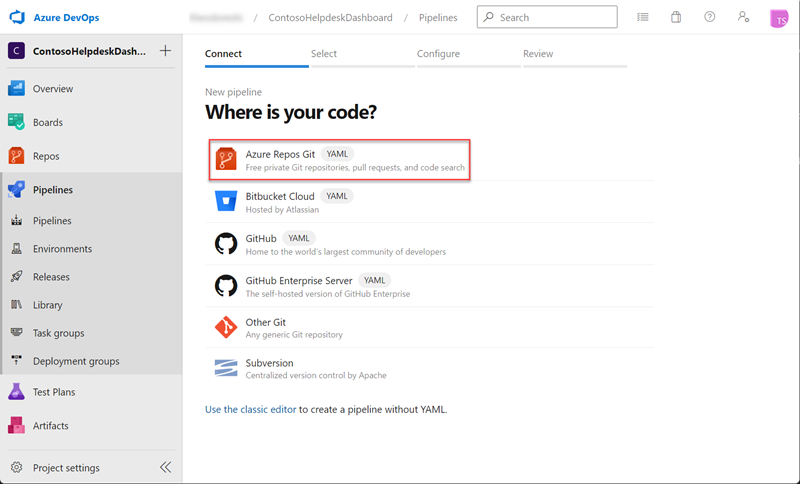

1. Select **\<your test repository>**.

    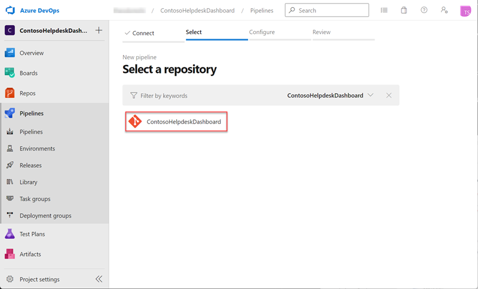

1. In the **Configure your pipeline** tab, select **Existing Azure Pipelines YAML file**.

    

1. In the **Select an existing YAML file** panel on the right, select **/.azure/pipelines/provision.dev.yml**, and select **Continue**.

    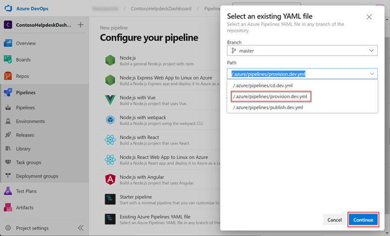

1. Select **Variables** > **New variable** to create the variables below and enter the corresponding values. After configuring all the variables, select **Save** to close the panel.

    > [!NOTE] 
    > A non-interactive authentication style for M365 is used in CI/CD workflows, so please ensure that your M365 account has sufficient privileges in your tenant and doesn't have multi-factor authentication or other advanced security features enabled.

    - M365_ACCOUNT_NAME
    - M365_ACCOUNT_PASSWORD
    - M365_TENANT_ID
    - AZURE_SERVICE_PRINCIPAL_NAME
    - AZURE_SERVICE_PRINCIPAL_PASSWORD
    - AZURE_SUBSCRIPTION_ID
    - AZURE_TENANT_ID

    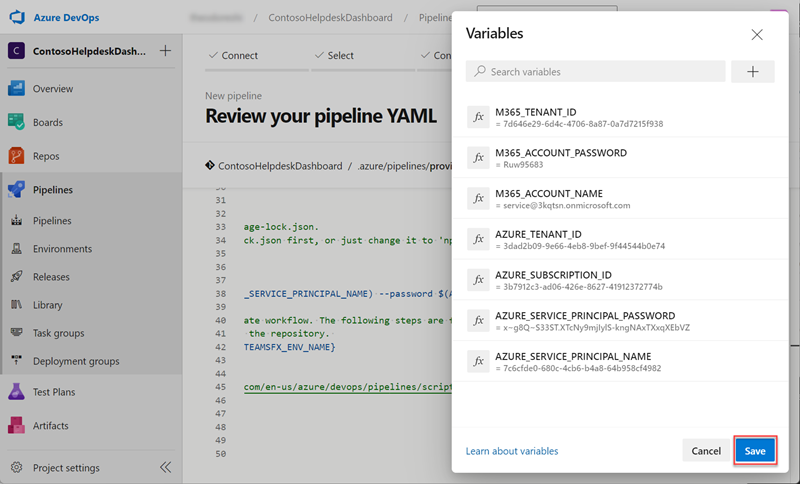

1. Select the down arrow icon to the right of the **Run** button and select **Save** to create the pipeline.

    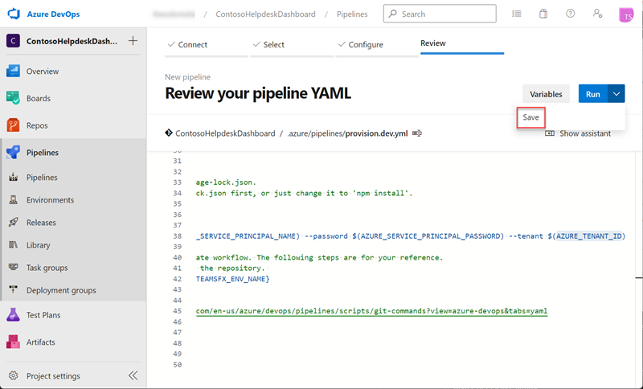

1. Select the more options icon > **Rename/move** to rename the pipeline to a friendly name, e.g. helpdesk-provision.

    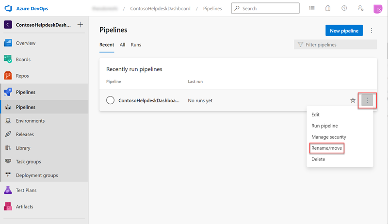

1. For **helpdesk-provision** pipeline, select more options icon > **Run Pipeline**. 

    > [!NOTE] 
    > Make sure you have [enabled scripts to run Git commands](https://docs.microsoft.com/en-us/azure/devops/pipelines/scripts/git-commands?view=azure-devops&tabs=yaml#enable-scripts-to-run-git-commands).

    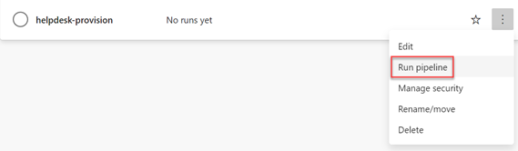

1. Select **Run** to manually trigger this pipeline, and wait for it to finish executing.

    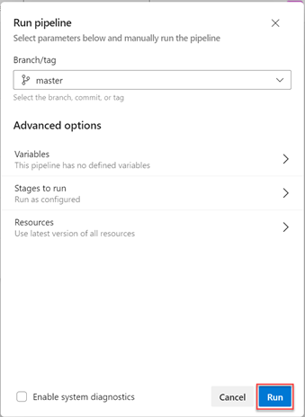

1. Repeat the above steps for importing to import the **/.azure/pipelines/cd.dev.yml** pipeline, and add the  variables below to the pipeline. Then, rename the pipeline to a friendly name, e.g. helpdesk-cd.

    - AZURE_SERVICE_PRINCIPAL_NAME
    - AZURE_SERVICE_PRINCIPAL_PASSWORD
    - AZURE_TENANT_ID

1. Trigger the **helpdesk-cd** pipeline manually and wait for it to finish executing.

1. Repeat the above steps for importing to import **/.azure/pipelines/publish.dev.yml** pipeline, and add the  variables below to the pipeline. Then, rename the pipeline to a friendly name, e.g. helpdesk-publish.

    - M365_ACCOUNT_NAME
    - M365_ACCOUNT_PASSWORD
    - M365_TENANT_ID

1. Trigger the **helpdesk-publish** pipeline manually and wait for it to finish executing.

## Task 4: Test App Automated Deployment

1. Open a browser and navigate to the [Microsoft Teams admin center](https://admin.teams.microsoft.com/policies/manage-apps). Sign in using a **Work or School Account** that is a Global Admin or Teams Service Admin.

1. In apps table, click the **Publishing status** column header to sort.  Then, click the Teams App you published through **helpdesk-publish** pipeline.

    

1. Select **Publish** to approve the Teams app.

1. Open a new tab in your browser, navigate to [Microsoft Teams](https://teams.microsoft.com/) and select **Apps** in left sidebar.

    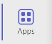

1. Select **Built for your org**, and click **HelpdeskDashboard-CICD** app to install the Teams app to a test team.

    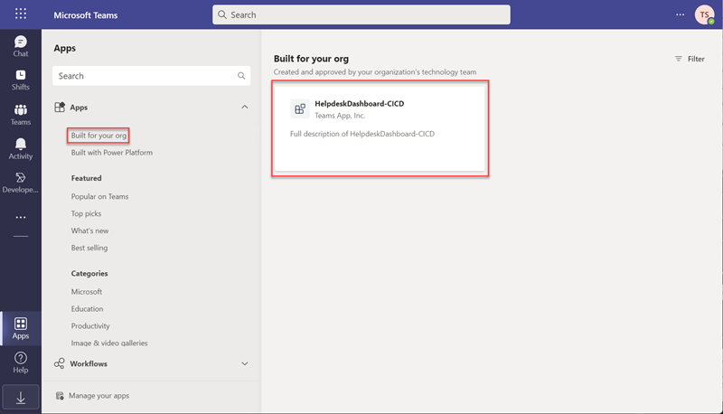

1. In the Trending Topics tab you installed, observe these data items, next we will update the source code to automatically update the content of this tab.

    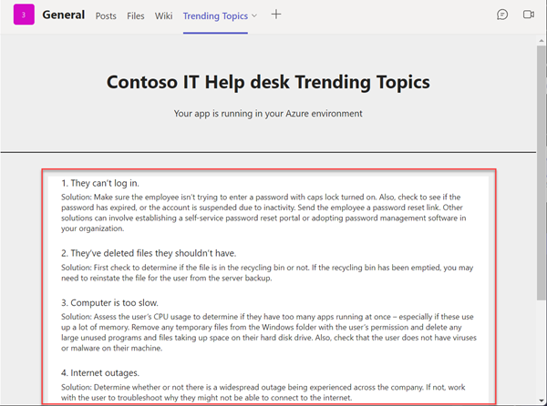

1. Open Visual Studio Code, then locate and open the **./tabs/src/components/TrendingTab.tsx** file.

1. Locate the statement `const items = [`, add a data item to the array. e.g.

   ```tsx
    {
        header: '0. Received an error code while updating.',
        content: `Solution: If you are receiving an error message with a specific error code, try running the Windows Update Troubleshooter. If that doesn't resolve the issue, see Fix Windows Update errors and follow the instructions to help resolve common update issues.`,
    },
   ```
1. Commit and push the change to your repo.

1. Wait for the **helpdesk-cd** pipeline to deploy the latest commit, and after waiting a bit you will notice your updates are displayed on the **Trending Topics** tab.

    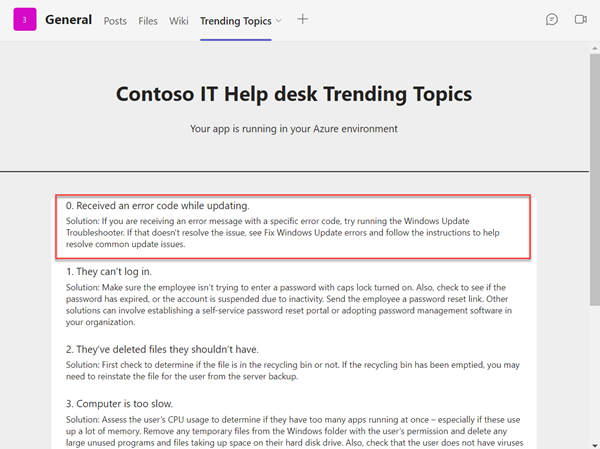

## Summary

In this exercise, you created CI/CD pipelines for a custom Teams App to automate deployment.