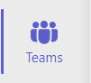
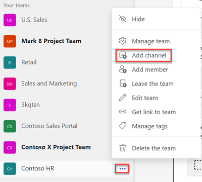
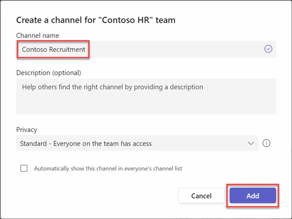
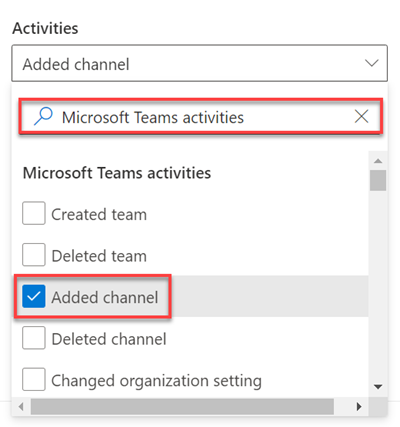
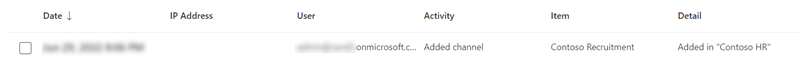

In this exercise, you will turn on auditing in Teams to enable retrieving Teams data from the audit log.

## Scenario

To improve the service efficiency of the IT Helpdesk, the IT Helpdesk wants to create a Trending Topics page to help customers solve some of the most common issues.

The sample application is a service bot and ticket dashboard for an IT Help Desk. Customers use Teams channels to interact with a bot to create help desk tickets. The bot asks for the category, priority, and description of each issue. The bot creates tickets and stores the data in Dataverse.

## Prerequisites

To complete the exercises in this module, you will need:

> [!IMPORTANT]
> In most cases, installing the latest version of the following tools is the best option. The versions listed here were used when this module was published and last tested.

- A Microsoft 365 tenant.
    > [!NOTE]
    > Follow the instructions on [Welcome to the Microsoft 365 Developer Program](https://docs.microsoft.com/office/developer-program/microsoft-365-developer-program) to obtain a developer tenant if you don't currently have a Microsoft 365 account. Make sure you also enable Microsoft Teams.

- [PowerShell](https://docs.microsoft.com/powershell/scripting/install/installing-powershell?view=powershell-7.2) - (7.2 or higher)
- An Azure subscription.
    > [!NOTE]
    > If you don't currently have an Azure account, you can create [a free Azure account](https://azure.microsoft.com/free/) before you start.
- [Node.js](https://nodejs.org/) - (v16.\* is recommended or higher)
- [TeamsFx CLI](https://www.npmjs.com/package/@microsoft/teamsfx-cli) - (v1.\* is recommended or higher)
- [Bicep](https://github.com/Azure/bicep/releases/latest/download/bicep-setup-win-x64.exe) - (v0.4 is recommended or higher)
- [Visual Studio Code](https://code.visualstudio.com)

You must have the minimum versions of these prerequisites installed on your workstation.

## Task 1: Verify the auditing status for your organization

1. Open a PowerShell 7 terminal with administrator privileges.

1. Execute the command below to install the EXO V2 module.

    ```powershell
    Install-Module -Name ExchangeOnlineManagement
    ```

1. In a PowerShell window, load the EXO V2 module by running the following command:

    ```powershell
    Import-Module ExchangeOnlineManagement
    ```

1. Execute the command below to connect to Exchange Online PowerShell with your M365 account.

    ```powershell
    Connect-ExchangeOnline -UserPrincipalName <your M365 user principal name>
    ```

1. To verify that auditing is turned on for your organization, run the following command:

    ```powershell
    Get-AdminAuditLogConfig | FL UnifiedAuditLogIngestionEnabled
    ```

    A value of True for the UnifiedAuditLogIngestionEnabled property indicates that auditing is turned on. A value of False indicates that auditing is not turned on.

## Task 2: Turn on auditing

If auditing is not turned on for your organization, you can turn it on in the compliance portal by following the steps below. It may take several hours after you turn on auditing before you can return results when you search the audit log.

1. Open a browser, go to https://compliance.microsoft.com, and sign in.

1. In the left navigation pane of the compliance portal, click **Audit**.

    If auditing is not turned on for your organization, a banner is displayed prompting you start recording user and admin activity.

    

1. Click the **Start recording user and admin activity** banner.

    > [!NOTE]
    > It may take up to 60 minutes for the change to take effect.

## Task 3: Searching for Teams activities in the audit log

> [!NOTE]
> We assume Auditing is already working in your Microsoft Purview compliance portal.

1. Open a new Tab from your browser, go to [Microsoft Teams](https://teams.microsoft.com/).

1. Select the **Teams** icon in sidebar.

    

1. In a test team, select the **More Options** icon then click **Add Channel**.

    

1. Enter a channel name, then click **Add**.

    
   
1. Open a new Tab from your browser and go to the [Audit Search page](https://compliance.microsoft.com/auditlogsearch).

1. Configure the following search criteria.

    - **Start date** and **End date**: Select a date and time range to display the events that occurred within that period. The last seven days are selected by default. The date and time are presented in Coordinated Universal Time (UTC) format. The maximum date range that you can specify is 90 days.

    - **Activities**: Enter **Microsoft Teams activities** to filter to Teams activities, and select **Added channel**.
    <br/>
    

1. Select **Search** to run the search using your search criteria.

1. The search results are loaded, and after a few moments they're displayed on a page in the audit log search tool.  Here you can see the audit log entry that correlates to the teams channel you created.

    

## Summary

In this exercise, you enabled auditing for Microsoft Teams and searched for the latest Teams activities in the Audit Search page.