In this exercise, you will take a tour of Application Insights for a custom Teams App to learn how it may be used to debug and troubleshoot and monitor and improve performance.

## Task 1: Create a Microsoft Teams app package

1. From the **Allfiles** folder, copy the **Helpdesk-Monitor-App** folder to your local workstation.

1. Open a Command Prompt with Administrative privileges.

1. From the command line, change the directory to the **Helpdesk-Monitor-App** folder you copied to your local machine.

1. Execute the command below to log in to Microsoft 365.

    ```powershell
    teamsfx account login m365
    ```
1. Execute the command below to log in to Microsoft Azure.
    > [!NOTE]
    > If you have multiple Microsoft Azure subscriptions, execute this command `teamsfx account set --subscription <Subscription ID>` to select the subscription you will use for testing.

    ```powershell
    teamsfx account login azure
    ```
1. Execute the command below to provision the cloud resources.

    ```powershell
    teamsfx provision
    ```
    Enter the following values when prompted:

    - **? Select a resource group:** *+ New resource group*
    - **? New resource group name:** *helpdesk_dashboard_monitor-dev-rg*
    - **? Location for the new resource group:** *West US*
    - **? Do you want to provision resources in dev environment?** *Yes* 

    <br/>

1. After the `Teamsfx Provision` command is executed, the link to the Azure Resource Group will be shown in the output.  Copy it from the command line.

    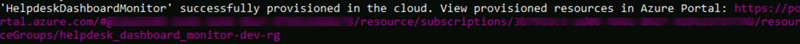

1. Open a browser and navigate to the Azure Resource Group you just provisioned.

1. In **Resources** list, select the **Application Insights** resource.

    

1. Copy the value of the **Instrumentation Key**. You will need this value later.

    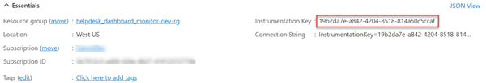

1. Open the **./Helpdesk-Monitor-App/tabs/.env.teamsfx.dev** file with Visual Studio Code.

1. Add the code below to the end of the file, and replace the **<Instrumentation Key>** placeholder with the Instrumentation Key value you just copied from the Azure Portal.

    ```
    REACT_APP_INSTRUMENTATION_KEY=<Instrumentation Key>
    ```

1. Return to command line and execute the command below to deploy the application.

     ```powershell
    teamsfx deploy
    ```

    Enter the following values when prompted:

    - **? Whether to deploy aad manifest:** *no*
    - **? Whether to deploy app manifest to Teams platform:** *no*
    - **? Do you want to deploy resources in dev environment?** *yes*

    <br/>

1. Execute the command below to build your Teams app into a package.

     ```powershell
    teamsfx package
    ```

    Enter the following values when prompted:

    - **? Select an environment:** *dev*

    <br/>

    When the command is executed successfully, an app package (.zip file) is created in the **./Helpdesk-Monitor-App/build/appPackage/** folder. You will need this zip file later.

## Task 2: Upload and run the custom Teams app

1. Open a new tab in your browser and go to [Microsoft Teams](https://teams.microsoft.com/), then select **Apps**.

    

1. Select **Manage your apps** \> **Upload an app** \> **Upload a custom app** to upload your packaged zip file.

    

1. Select **Add** in the dialog.

    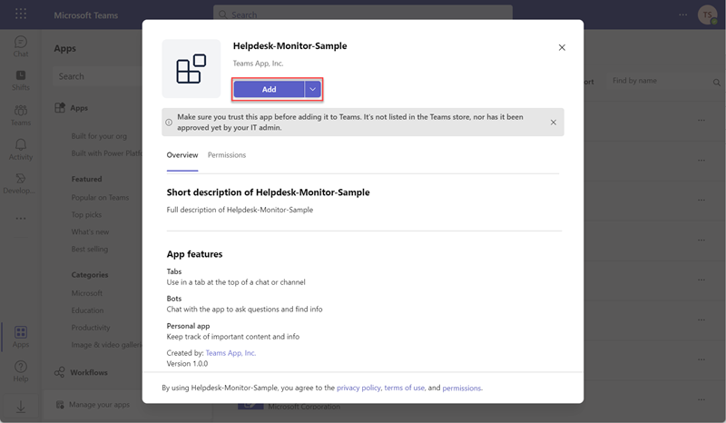

1. Now you have successfully added the custom Teams App. Now run the Teams App to produce some telemetry data in Application Insights.

    1. In **Chat** tab, enter the command below in the custom Teams bot to quickly log some telemetry data.

        ```
        Log Info Message
        ```

        The Log Info Message bot command executes the following code in the logCommandHandler.ts file.

        ```
        import { Activity, TurnContext } from "botbuilder";
        import {
        CommandMessage,
        TeamsFxBotCommandHandler,
        TriggerPatterns,
        } from "@microsoft/teamsfx";
        import * as appInsights  from "applicationinsights";

        export class LogCommandHandler implements TeamsFxBotCommandHandler {
        triggerPatterns: TriggerPatterns = "Log Info Message";

        async handleCommandReceived(
            context: TurnContext,
            message: CommandMessage
        ): Promise<string | Partial<Activity> | void> {
            console.log(`Bot received message: ${message.text}`);

            let client = appInsights.defaultClient;

            client.trackEvent({name: "LogCommandHandler event", properties: {customProperty: "CommandHandler"}});

            client.trackMetric({name: "Teams App custom metric", value: Date.now()});

            client.trackTrace({message: "wrote an informational message to app insights"});

            await context.sendActivity(`The logCommandHandler is triggered.`);
        }
        }
        ```       

        The following code imports the Application Insights library.
        
        ```
        import * as appInsights  from "applicationinsights"; 
        ```

        The following line of code establishes the Application Insights context object.  This object contains all the functions use to log Events, Metrics, and Trace logs to Application Insights.

        ```
        let client = appInsights.defaultClient;
        ```
    
        Finally, the following lines of code create new Event, Metric, and Trace logs in Application Insights.  Notice how all three logs are commited in a single batch in the last line of code.
    
        ```
        client.trackEvent({name: "LogCommandHandler event", properties: {customProperty: "CommandHandler"}});

        client.trackMetric({name: "Teams App custom metric", value: Date.now()});

        client.trackTrace({message: "wrote an informational message to app insights"});

        await context.sendActivity(`The logCommandHandler is triggered.`);
        ```

    1. Return to Application Insights overview page, select **Logs** under the **Monitoring** menu.

        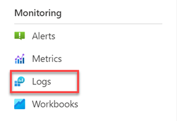
        
    1. Enter **traces** in log query editor box, and select **Run**. 

        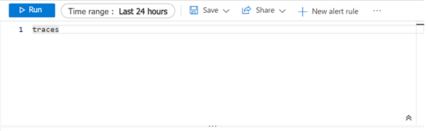
        
    1. Observe the query results, the trace information sent by the Teams Bot has been successfully written to application insights.

        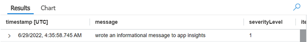

    1. Enter **customEvents** in log query editor box, and select **Run**.

    1. Observe the query results, the custom event sent by the Teams Bot has been successfully written to application insights.

        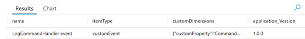
        
    1. Enter **customMetrics** in log query editor box, and select **Run**.

    1. Observe the query results, the custom metrics sent by the Teams Bot has been successfully written to application insights.
    
        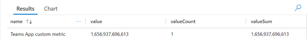

    
## Task 3: Application Insights Overview dashboard

In this exercise, the Sample Teams App we deployed earlier has been enhanced.  It now includes Application Insights so we can monitor this custom Teams app.

> [!NOTE]
> The monitoring data in the screenshots in the following steps may be inconsistent with what you see in your environment. It all depends on the usage of the Teams App.

1. Return to the **Application Insights** resource you opened earlier. 

    In this page, Application Insights always provides a summary overview pane to allow a quick, at-a-glance assessment of your Teams app's health and performance. 

    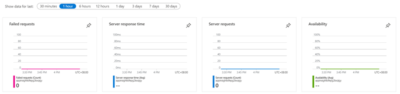

1. Select **Application Dashboard** in the upper left corner.

    The Application dashboard leverages the existing dashboard technology within Azure to provide a fully customizable single pane view of your application's health and performance.

    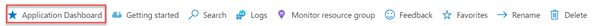

    If this is your first time accessing the dashboard, it will launch a default view that looks similar to this.

    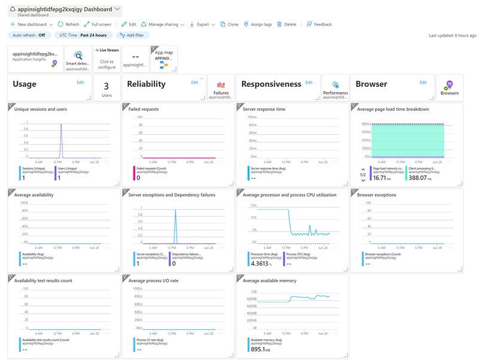

    You can keep the default view if you like it. Or you can also add and delete from the dashboard to best fit the needs of your team and the app.

1. To navigate back to the overview experience just click:

    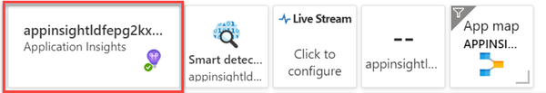


## Task 4: Monitor performance details for the custom Teams app

Application Insights collects performance details for the different operations in your Teams app. By identifying the operations with the longest duration, you can diagnose potential problems or best target your ongoing development to improve the overall performance of the Teams app.

1. In the overview page, to open the **Performance** panel either select **Performance** under the **Investigate** menu, or click the **Server Response Time** chart.

    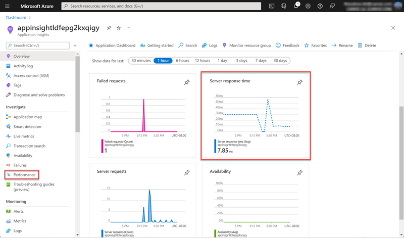

1. The **Performance** panel shows the count and average duration of each operation for the application. You can use this information to identify the operations that impact users the most. 

    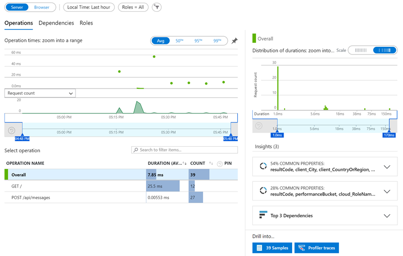

1. The chart currently shows the average duration of the selected operations over time. You can switch to the 95th percentile to find the performance issues. You can add the operations that you're interested in by pinning them to the chart. This shows that there are some peaks worth investigating. You can isolate this further by reducing the time window displayed by the chart.

    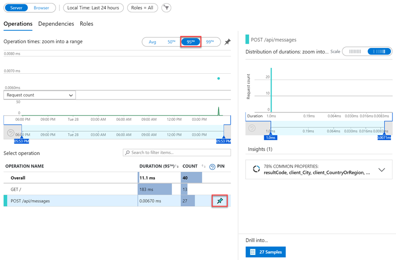

1. The performance panel on the right shows distribution of durations for different requests for the selected operation. You can reduce the window to start around the 95th percentile then use the "Top 3 dependencies" insights card.  This can tell you at a glance what external dependencies are likely contributing to the slow transactions. 

    

1. In this example, you can see at a glance that the call to Teams BOT API is contributing the most to the total count of the transaction. You can click on any item in the list to see its details on the right side.

    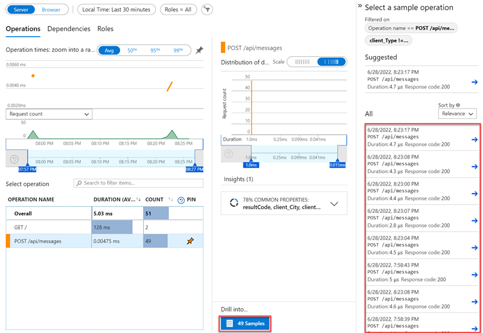

    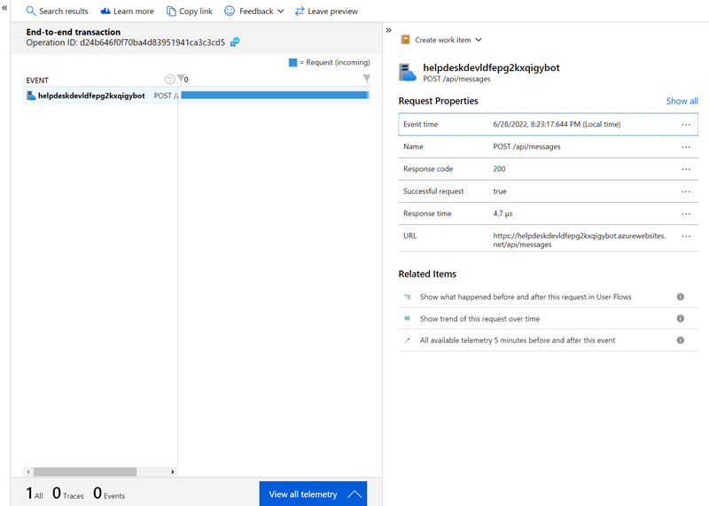

Application Insights is a very powerful monitoring tool and you can [learn more about it here](https://docs.microsoft.com/en-us/azure/azure-monitor/app/app-insights-overview).

## Summary

In this exercise, you have an overview of Application Insights, and utilize Application Insights to monitor the performance of a custom Teams app.