n this exercise, you will use the Log Analytics tool to edit and run log queries from the data collected by Azure Application Insights from the Teams App.  Then we will interactively analyze the data.

## Task 1: Create a Microsoft Teams app package

1. From the **Allfiles** folder, copy the **Helpdesk-Analyze-Logs**  folder to your local workstation.

1. Open a Command Prompt with Administrative privileges.

1. From the command line, change the directory to the **Helpdesk-Analyze-Logs** folder you copied to your local machine.

1. Execute the command below to log in to Microsoft 365.

    ```powershell
    teamsfx account login m365
    ```
1. Execute the command below to log in to Microsoft Azure.
    > [!NOTE]
    > If you have multiple Microsoft Azure subscriptions, execute this command `teamsfx account set --subscription <Subscription ID>` to select the subscription you will use for testing.

    ```powershell
    teamsfx account login azure
    ```
1. Execute the command below to provision the cloud resources.

    ```powershell
    teamsfx provision
    ```
    Enter the following values when prompted:

    - **? Select a resource group:** *+ New resource group*
    - **? New resource group name:** *helpdesk_analyze_logs-dev-rg*
    - **? Location for the new resource group:** *West US*
    - **? Do you want to provision resources in dev environment?** *Yes* 

    <br/>

1. After the `Teamsfx Provision` command is executed, the link to the Azure Resource Group will be shown in the output.  Copy it from the command line.

    

1. Open a browser and navigate to the Azure Resource Group you just provisioned.

1. In the **Resources** list, select the **Application Insights** resource.

    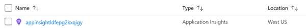

1. Copy the value of the **Instrumentation Key**. Save this value in a text file. You will need this value later.

    

1. Open the **./Helpdesk-Analyze-Logs/tabs/.env.teamsfx.dev** file with Visual Studio Code.

1. Add the code below to the end of the file, and replace the `<Instrumentation Key>` placeholder with the Instrumentation Key value you just copied from the Azure Portal.

    ```
    REACT_APP_INSTRUMENTATION_KEY=<Instrumentation Key>
    ```

1. Return to command line and execute the command below to deploy the application.

     ```powershell
    teamsfx deploy
    ```

    Enter the following values when prompted:

    - **? Whether to deploy aad manifest:** *no*
    - **? Do you want to deploy resources in dev environment?** *yes*

    <br/>

1. Execute the command below to build your Teams app into a package.

     ```powershell
    teamsfx package
    ```

    Enter the following values when prompted:

    - **? Select an environment:** *dev*

    <br/>

    When the command is executed successfully, an app package (.zip file) is created in the **./Helpdesk-Analyze-Logs/build/appPackage/** folder. You will need this zip file later.

## Task 2: Upload and run the custom Teams app

1. Open a new tab in your browser and go to [Microsoft Teams](https://teams.microsoft.com/), then select **Apps**.

    

1. Select **Manage your apps** \> **Upload an app** \> **Upload a custom app** to upload your packaged zip file.

    

1. Select **Add** in the dialog.

    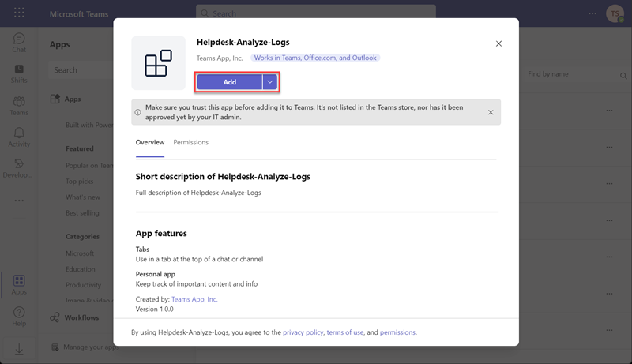

1. Now you have successfully added the custom Teams App.

    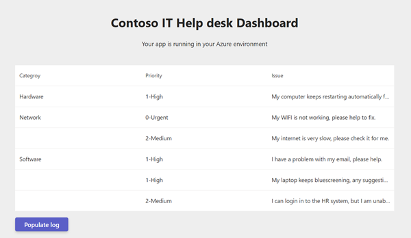

1. Select **Populate log** to produce some sample log data in Application Insights. This process may take about 2 minutes, and the page will continually refresh.  **Please do not close the Teams tab during this time or the sample data creation will stop.**  Each time the page refreshes it is logged in Application Insights as a page view.  The sample data creation is complete when the page no longer automatically refreshes itself.

## Task 3: Log Analytics

Log Analytics is a tool in the Azure portal to edit and run log queries from data collected by Azure Monitor logs and interactively analyze their results. 

Return to the **Application Insights** resource you opened earlier. select **Logs** from the Azure Monitor menu.

### View table information

The left side of the screen includes the **Tables** tab, where you can inspect the tables that are available in the current scope. These tables are grouped by **Solution** by default, but you can change their grouping or filter them.

Expand the **Application Insights** solution and locate the **pageViews** table. You can expand the table to view its schema, or hover over its name to show more information about it.

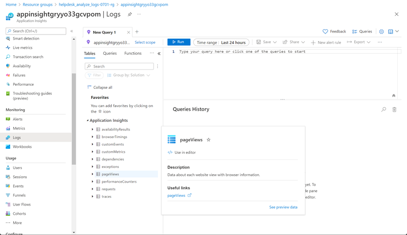

Select the link below **Useful links** to go to the table reference that documents each table and its columns. Select **Preview data** to have a quick look at a few recent records in the table. This preview can be useful to ensure that this is the data that you're expecting before you run a query with it.

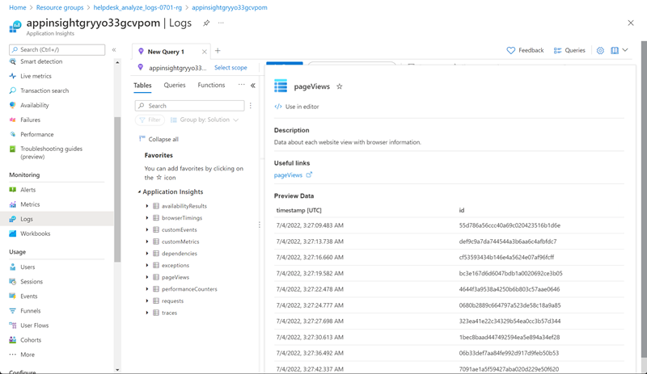

### Write a query

Let's write a query by using the **pageViews** table. Double-click its name to add it to the query window. You can also type directly in the window. You can even get IntelliSense that will help complete the names of tables in the current scope and Kusto Query Language (KQL) commands.

This is the simplest query that we can write. It returns all the records in a table. Run it by selecting the **Run** button or by selecting **Shift+Enter** with the cursor positioned anywhere in the query text.

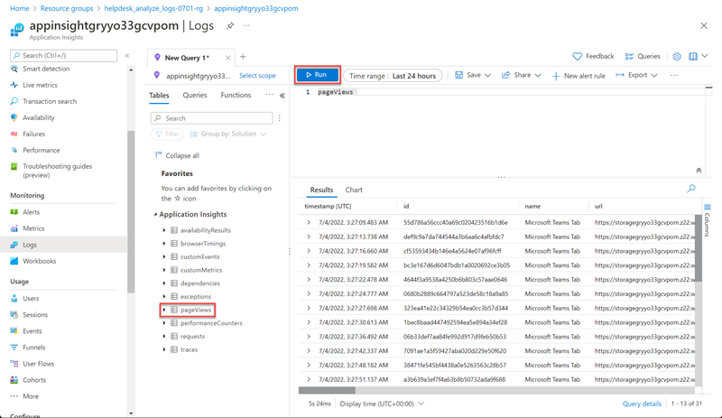

You can see the results. The number of records that the query returns appears in the lower-right corner.

### Time range

All queries return records generated within a set time range. By default, the query returns records generated in the last 24 hours.

You can set a different time range by using the **where** operator in the query. You can also use the **Time range** dropdown list at the top of the screen.

Let's change the time range of the query by selecting **Last 12** hours from the **Time range** dropdown. Select **Run** to return the results.

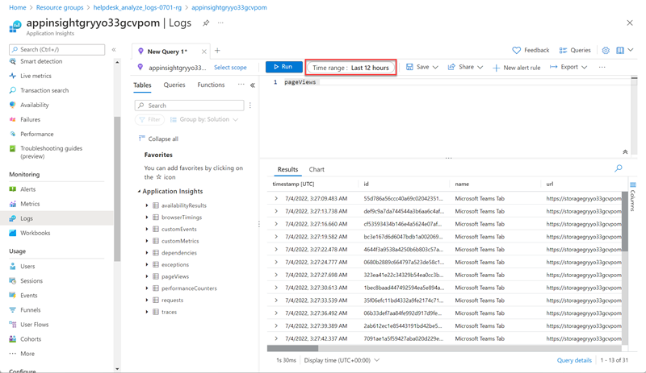

### Multiple query conditions

Let's reduce our results further by adding another filter condition. A query can include any number of filters to target exactly the set of records that you want. Run the multi-condition query expression below to filter out the **Trending Tab** page.

```
pageViews 
| where indexof(url, 'trending') >= 0
| where client_Type == 'Browser'
```

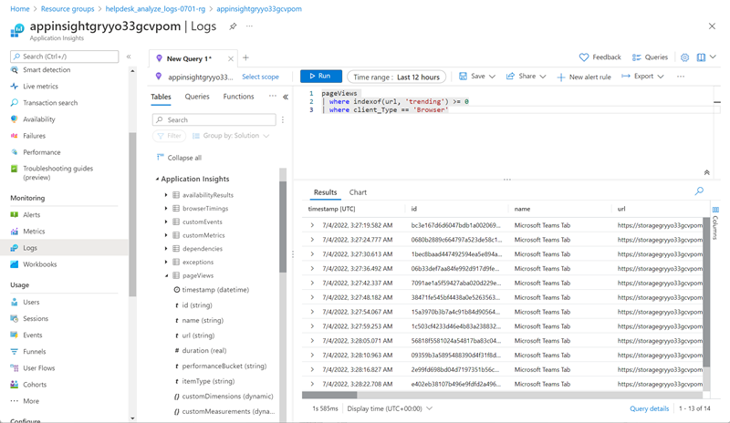

### Analyze results

In addition to helping you write and run queries, Log Analytics provides features for working with the results. Start by expanding a record to view the values for all of its columns.

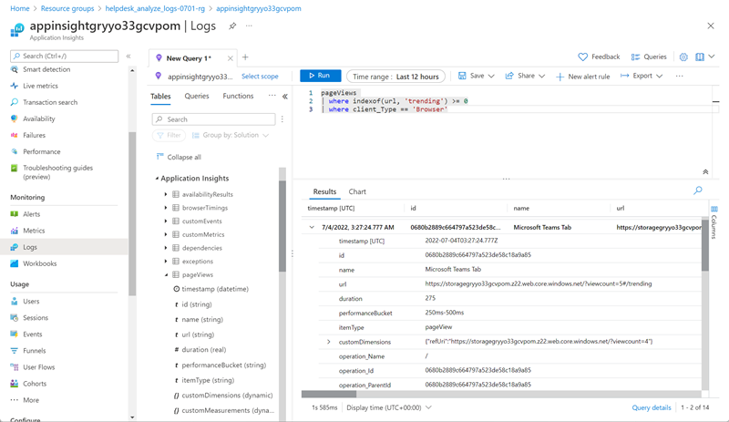

Select the name of any column to sort the results by that column. Select the filter icon next to it to provide a filter condition. This action is similar to adding a filter condition to the query itself, except that this filter is cleared if the query is run again. Use this method if you want to quickly analyze a set of records as part of interactive analysis.

For example, set a filter on the **duration** column to limit the records to those that took more than **900** milliseconds.


### Search through query results

Let's search through the query results by using the search box at the top right of the results pane.

Enter anything you prefer in the query results search box, and select the arrows to find all instances of this string in your search results.

In this example, the search term **Edg** is used (the first 3 letters of the Edge browser):

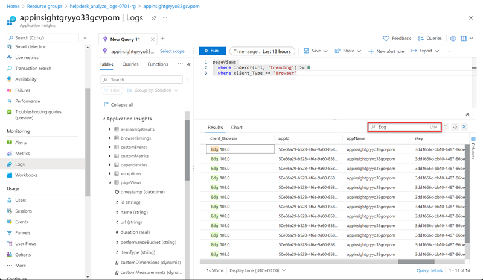

### Reorganize and summarize data

To better visualize your data, you can reorganize and summarize the data in the query results based on your needs.

Select **Columns** to the right of the results pane to open the **Columns** sidebar.

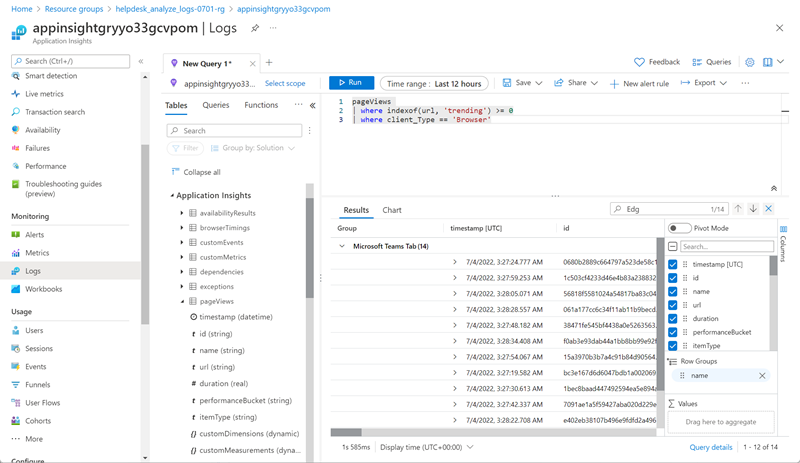

### Create a pivot table

To analyze the performance of your pages, create a pivot table.

In the **Columns** sidebar, select **Pivot** Mode.

Select **Url** and **duration** to show the total duration of all calls to each URL.

To view the maximum call duration to each URL, select **sum(duration)** > **max**.

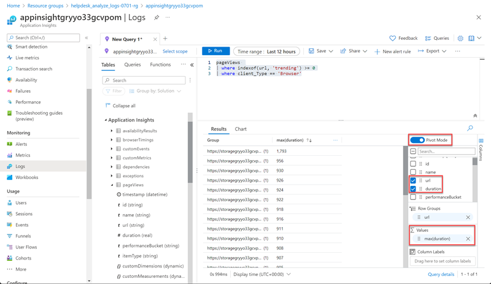

## Summary

In this exercise, you learned how to use Log Analytics to analyze data from a custom Teams app.