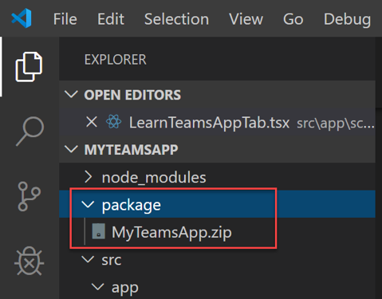

# Exercise 7: Creating a Bot in Microsoft Teams

Conversational bots allow users to interact with your web service through text, interactive cards, and task modules. They're incredibly flexible — conversational bots can be scoped to handling a few simple commands or complex, artificial-intelligence-powered and natural-language-processing virtual assistants. They can be one aspect of a larger application, or completely stand-alone.

## Task 1: Create a Bots project

1. In **Visual Studio Code**, select **Microsoft Teams** on the left Activity Bar and choose **Create a new Teams app**.

    

1. When prompted, sign in with your Microsoft 365 development account.

1. On the **Add capabilities** screen, select **Bots** then **Next**.

1. Set the following properties for your project:

   - Enter a name for your Teams app. (This is the default name for your app and also the name of the app project directory on your local machine.)

   - Select **Create Bot Registration** to create a new bot.

1. Select **Finish** at the bottom of the screen to configure your project.

## Task 2: Configure scope for your bot

1. In **Visual Studio Code**, select **App Studio** in **Microsoft Teams Toolkit**.

1. When prompted, sign in with your Microsoft 365 development account.

1. Select **Bots** under **Capabilities** section in left menu and click **Edit**.

    

1. For the **Scope**: ensure **teams**, **personal** and **groupChat** options are checked.

1. Click **Save** button to close the popup box.

   

    >    **Note**:
    >    A conversation is a series of messages sent between your bot and one or more users. There are three kinds of conversations (also called scopes) in Teams:
    >
    >    - **teams**: Also called channel conversations, visible to all members of the channel.
    >
    >    - **personal**: Conversations between bots and a single user.
    >
    >    - **groupChat**: Chat between a bot and two or more users. Also enables your bot in meeting chats.
    >

1. Open a command prompt and execute the following command:

    ```powershell
    ngrok http -host-header=rewrite 3978
    ```

   > This will start ngrok and will tunnel requests from an external ngrok url to your development machine on port 3978. Copy the https forwarding address (for example: https://787b8292.ngrok.io) You will need this for the next step.

1. Return to **Visual Studio Code**.

1. Set the **Messaging endpoint** to the current https URL that was part of the output when you ran ngrok (in previous step) and append it with the path /api/messages. It should look similar to `https://{subdomain}.ngrok.io/api/messages`.

## Task 3: Run your bot

1. Open Terminal in Visual Studio Code. From the Visual Studio Code ribbon select **Terminal > New Terminal**.

1. Run `npm install` to install all dependent packages for the Teams tab.

1. Run `npm start` to start the app.

1. In Visual Studio Code, press the **F5** key to launch a Teams web client.

1. Go back to Teams. In the dialog, select one of the following:

    - **Add for me** to install the bot as a personal bot.
    - **Add to a team** or **Add to a chat** to install the bot as a a group/channel bot.

1. Try to send "**Hello**" to start a conversation with the bot.

1. Go back to the Visual Studio Code project. Stop the running project by selecting **Ctrl + C**.

## Task 4: Send proactive messages

A proactive message is any message sent by a bot that is not in direct response to a request from a user.

1. From Visual Studio Code, open the **index.js** file in the root folder.

1. Locate the code `const botActivityHandler = new BotActivityHandler...`, update the contents to match the following code.

    ```javascript
    const conversationReferences = {};
    const botActivityHandler = new BotActivityHandler(conversationReferences);
    ```

1. Add the following code to end of **index.js** file.

    ```javascript
    // Listen for incoming notifications and send proactive messages to users.
    server.get('/api/notify', async (req, res) => {
        for (const conversationReference of Object.values(conversationReferences)) {
            await adapter.continueConversation(conversationReference, async turnContext => {
                // If you encounter permission-related errors when sending this message, see
                // https://aka.ms/BotTrustServiceUrl
                await turnContext.sendActivity('proactive hello');
            });
        }

        res.setHeader('Content-Type', 'text/html');
        res.writeHead(200);
        res.write('<html><body><h1>Proactive messages have been sent.</h1></body></html>');
        res.end();
    });
    ```

1. Open the **botActivityHandler.js** file in the root folder.

1. Add a parameter `conversationReferences` for the **constructor** method and update the contents to match the following code.

    ```javascript
    constructor(conversationReferences) {
        super();

        // Dependency injected dictionary for storing ConversationReference objects used in NotifyController to proactively message users
        this.conversationReferences = conversationReferences;

        this.onConversationUpdate(async (context, next) => {
            this.addConversationReference(context.activity);

            await next();
        });

        this.onMembersAdded(async (context, next) => {
            const membersAdded = context.activity.membersAdded;
            for (let cnt = 0; cnt < membersAdded.length; cnt++) {
                if (membersAdded[cnt].id !== context.activity.recipient.id) {
                    const welcomeMessage = 'Welcome to the Proactive Bot sample.  Navigate to http://localhost:3978/api/notify to proactively message everyone who has previously messaged this bot.';
                    await context.sendActivity(welcomeMessage);
                }
            }

            // By calling next() you ensure that the next BotHandler is run.
            await next();
        });

        /* Conversation Bot */
        /*  Teams bots are Microsoft Bot Framework bots.
            If a bot receives a message activity, the turn handler sees that incoming activity
            and sends it to the onMessage activity handler.
            Learn more: https://aka.ms/teams-bot-basics.

            NOTE:   Ensure the bot endpoint that services incoming conversational bot queries is
                    registered with Bot Framework.
                    Learn more: https://aka.ms/teams-register-bot. 
        */
        // Registers an activity event handler for the message event, emitted for every incoming message activity.
        this.onMessage(async (context, next) => {
            this.addConversationReference(context.activity);

            TurnContext.removeRecipientMention(context.activity);
            switch (context.activity.text.trim()) {
            case 'Hello':
                await this.mentionActivityAsync(context);
                break;
            default:
                // By default for unknown activity sent by user show
                // a card with the available actions.
                const value = { count: 0 };
                const card = CardFactory.heroCard(
                    'Lets talk...',
                    null,
                    [{
                        type: ActionTypes.MessageBack,
                        title: 'Say Hello',
                        value: value,
                        text: 'Hello'
                    }]);
                await context.sendActivity({ attachments: [card] });
                break;
            }
            await next();
        });
        /* Conversation Bot */
    }
    ```

1. Locate the method `mentionActivityAsync`, and append the following code after the method.

    ```javascript
    addConversationReference(activity) {
        const conversationReference = TurnContext.getConversationReference(activity);
        this.conversationReferences[conversationReference.conversation.id] = conversationReference;
    }
    ```

1. Run `npm start` to start the app again.

1. In Visual Studio Code, press the **F5** key to launch a Teams web client.

1. Select **Add** to install the bot to a Team/Chat.

1. In your browser, open the page [http://localhost:3978/api/notify](http://localhost:3978/api/notify) to send a proactive message.

1. A message **"proactive hello"** will be received in your conversation thread.

## Task 5: Authentication flow for bots in Microsoft Teams

### Create the resource group

The resource group and the service plan aren't strictly necessary but they allow you to conveniently release the resources you create. This is good practice for keeping your resources organized and manageable.

1. In your browser, sign into the [Azure portal](https://ms.portal.azure.com/).

1. In the left navigation panel, select **Resource groups**.

1. In the upper left of the displayed window, select **Add** tab to create a new resource group.

1. You'll be prompted to provide the following:

    - **Subscription**: Use your existing subscription.

    - **Resource group**: Enter the name for the resource group. An example could be `TeamsResourceGroup`. Remember that the name must be unique.

    - From the **Region** drop-down menu: select `West US` or your closest region.

    - Select the **Review and create** button. You should see a banner that reads `Validation passed`.

1. Select the **Create** button. It may take a few minutes to create the resource group.

### Create the service plan

1. In the [Azure portal](https://ms.portal.azure.com/), on the left navigation panel, select **Create a resource**.

1. In the search box, type `App Service Plan`. Select the **App Service Plan** card from the search results.

1. Select **Create**.

1. You'll be prompted to provide the following:

    - **Subscription**: You can use an existing subscription.

    - **Resource Group**: Select the group you created earlier.

    - **Name**: Enter the name for the service plan. 
    > An example could be `TeamsServicePlan`. The name must be unique within the group and will prompted if the name you are trying to use already exists.

    - **Operating System**: Select `Windows` or your applicable OS.

    - **Region**: Select `West US` or your closest region.

    - **Pricing Tier**: Make sure `Standard S1` is selected. This should be the default value.

1. Select the **Review and create** button.
    > You should see a banner that reads `Validation passed`.

1. Select **Create**.
    > It may take a few minutes to create the app service plan. The plan will be listed in the resource group.

### Create the bot channels registration

The bot channels registration registers your web service as a bot with the Bot Framework, provided you have a Microsoft App Id and App password (client secret).

1. In the Azure portal, under Azure services, select **Create a resource**.

1. In the search box enter "bot". And in the drop-down list, select **Bot Channels Registration**.

1. Select the **Create** button.

1. In the **Bot Channel Registration** blade, provide the requested information about your bot.

1. Open a command prompt to execute the following command:

    ```powershell
    ngrok http -host-header=rewrite 3978
    ```

   > This will start ngrok and will tunnel requests from an external ngrok url to your development machine on port 3978. Copy the https forwarding address (for example: https://787b8292.ngrok.io). You will need this in the next step.

1. Return to **Azure portal site**.

1. Set the **Messaging endpoint** to the current https URL that was the URL output given by running ngrok (in previous step) and append it with the path /api/messages. It should look similar to `https://{subdomain}.ngrok.io/api/messages`.

    

1. Click **Microsoft App ID and password** and then **Create New**.

    

    

1. Click **Create App ID in the App Registration Portal** link.

    

1. In the displayed **App registration** window, click the **New registration** tab in the upper left.

1. Enter the name of the bot application you are registering. For example, `BotTeamsAuth` (name must be unique).

1. For the **Supported account types** select `Accounts in any organizational directory (Any Azure AD directory - Multitenant) and personal Microsoft accounts (e.g. Skype, Xbox)`.

1. Click the **Register** button. 
    > Once completed, Azure displays the Overview page for the application.

1. Copy and save to a file the **Application (client) ID** value.

1. In the left panel, click **Certificate and secrets**.

    - Under **Client secrets**: click **New client secret**.

        - Add a description to identify this secret from others you might need to create for this app.

    - Set **Expires** to your selection.

    - Click **Add**.

    - Copy the **Client secret value** and save it to a file or notepad.

1. Go back to the **Bot Channel Registration** window and copy the **App ID** and the **Client secret value** in the **Microsoft App ID** and **Password** boxes.

1. Click **OK**.

1. Finally, click **Create**.

> After Azure has created the registration resource it will be included in the resource group list.


Once your bot channels registration is created, you'll need to enable the Teams channel.

1. In the browser, open the [Azure portal](https://ms.portal.azure.com/).

1. Under Azure services, select the **Bot Channel Registration** you just created.

1. In the left panel, click **Channels**.

1. Click the Microsoft Teams icon and then choose **Save**.

    >  **Note**: The Bot Channels Registration resource will show the Global region even if you selected West US. This is expected.

### Create the identity provider

You need an identity provider that can be used for authentication. In this procedure you'll use an Azure AD provider; other Azure AD supported identity providers can also be used.

1. In the [Azure portal](https://ms.portal.azure.com/) on the left navigation panel, select **Azure Active Directory**.

1. In the left panel, select **App registrations**.

1. In the right panel, select the **New registration** tab, in the upper left.

1. You'll be asked to provide the following information:

    - **Name**: Enter the name for the application. 
        > An example could be `BotTeamsIdentity` (the name must be unique).

    - Select the **Supported account types** for your application and select `Accounts in any organizational directory (Any Azure AD directory - Multitenant) and personal Microsoft accounts (e.g. Skype, Xbox)`.

    - For the Redirect URI:
        - Select Web.
        - Set the URL to: https://token.botframework.com/.auth/web/redirect

    - Select **Register**.
        > Once it's created, Azure displays the Overview page for the app.

1. Copy and save the following information to a file:

    - The **Application (client) ID** value. You'll use this value later as the Client ID when you register this Azure identity application with your bot.

    - The **Directory (tenant) ID** value. You'll also use this value later as the Tenant ID to register this Azure identity application with your bot.

1. In the left panel, select **Certificates & secrets** to create a client secret for your application.

    - Under Client secrets, select **➕ New client secret**.

        - Add a description to identify this secret from others you might need to create for this app, such as `Bot identity app` in Teams.

    - Set **Expires** to your selection.

    - Select **Add**.

    - Before leaving this page, copy and save the **Client secret value** to a file or notepad. You'll use this value later as the Client secret when you register your Azure AD application with your bot.

### Configure the identity provider connection and register it with the bot

1. In the [Azure portal](https://ms.portal.azure.com/), select your resource group from the dashboard.

1. Select your bot channel registration link.

1. On the resource page, select **Settings**.

1. Under **OAuth Connection Settings** near the bottom of the page, select **Add Setting**.

1. Complete the form as follows:

    - **Name**: Enter a name for the connection. You'll use this name in your bot in the appsettings.json file. For example BotTeamsAuthADv2.

    - **Service Provider**: Select `Azure Active Directory v2`. 
        > Once you select this, the Azure AD-specific fields will be displayed.

    - **Client id**: Enter the Application (client) ID that you recorded for your Azure identity provider app in the steps above.

    -  **Client secret**: Enter the secret that you recorded for your Azure identity provider app in the steps above.

    - **Token Exchange URL**: Leave this blank.

    - **Tenant ID**: enter the Directory (tenant) ID that you copied earlier for your Azure identity app or common depending on the supported account type selected when you created the identity provider app. 
    
        To decide which value to assign follow this criteria:

        - If you selected **Accounts in this organizational directory only (Microsoft only - Single tenant)** or **Accounts in any organizational directory (Microsoft AAD directory - Multi tenant)** enter the tenant ID you copied earlier for the AAD app. 
            > This will be the tenant associated with the users who can be authenticated.

        - If you selected **Accounts in any organizational directory (Any AAD directory - Multi tenant and personal Microsoft accounts e.g. Skype, Xbox, Outlook)** enter the word `common` instead of a tenant ID. 
            > If you use tenant ID instead of common, the AAD app will verify through the tenant whose ID was selected and exclude personal Microsoft accounts.

    g. For **Scopes**, enter a space-delimited list of graph permissions this application requires e.g.: `User.Read` `User.ReadBasic.All`

1. Select **Save**.

### Test the connection

1. Select the connection entry to open the connection you just created.

1. Select **Test Connection** at the top of the **Service Provider Connection Setting** panel.

    > The first time you do this will open a new browser window asking you to select an account. Select the one you want to use.

1. Next, you'll be prompted with a permissions consent to allow to the identity provider to use your data (credentials).

    The following image is an example:

    

1. Select **Accept**.

1. This should then redirect you to **a Test Connection to <your-connection-name> Succeeded** page. Refresh the page if you get an error.

    The following image is an example:

    

> The connection name is used by the bot code to retrieve user authentication tokens.

### Prepare the bot sample code

1. In **Visual Studio Code**, select **Microsoft Teams --> Create a new Teams app**.

2. On the **Add capabilities** screen, select **Bots** and then click **Next**.

3. Enter a name for the application. 
    > For example: `TeamsBotAuthFlowSample` (name bust be unique)

4. Select **Use an existing bot registered with Bot Framework**,

    1. Set **bot App ID** to the bot App ID you saved at the time of the bot channel registration.

    1. Set **bot App Password** to the customer secret you saved at the time of the bot channel registration.

5. Select **Finish** at the bottom of the screen to configure your project.

6. In **Visual Studio Code**, open the **.env** file.

7. Append the following content to the end of the file. 
    > Set \<your-connection-name\> to  the name of the identity provider connection you added to the bot channel registration.

    ```javascript
        connectionName=<your-connection-name>
    ```

1. Open **index.js** in the root folder, and replace content with the following code:

    ```javascript
    // Copyright (c) Microsoft Corporation. All rights reserved.
    // Licensed under the MIT License.

    // index.js is used to setup and configure your bot

    // Import required packages
    const path = require('path');
    const express = require('express');

    // Import required bot services.
    // See https://aka.ms/bot-services to learn more about the different parts of a bot.
    const { BotFrameworkAdapter, MemoryStorage, UserState, ConversationState } = require('botbuilder');

    // Import bot definitions
    const { BotActivityHandler } = require('./botActivityHandler');

    const { MainDialog } = require('./dialogs/mainDialog');

    // Read botFilePath and botFileSecret from .env file.
    const ENV_FILE = path.join(__dirname, '.env');
    require('dotenv').config({ path: ENV_FILE });

    // Create adapter.
    // See https://aka.ms/about-bot-adapter to learn more about adapters.
    const adapter = new BotFrameworkAdapter({
        appId: process.env.BotId,
        appPassword: process.env.BotPassword
    });

    adapter.onTurnError = async (context, error) => {
        // This check writes out errors to console log .vs. app insights.
        // NOTE: In production environment, you should consider logging this to Azure
        //       application insights.
        console.error(`\n [onTurnError] unhandled error: ${ error }`);

        // Send a trace activity, which will be displayed in Bot Framework Emulator
        await context.sendTraceActivity(
            'OnTurnError Trace',
            `${ error }`,
            'https://www.botframework.com/schemas/error',
            'TurnError'
        );

        // Send a message to the user
        await context.sendActivity('The bot encountered an error or bug.');
        await context.sendActivity('To continue to run this bot, please fix the bot source code.');
    };

    // Define the state store for your bot.
    // See https://aka.ms/about-bot-state to learn more about using MemoryStorage.
    // A bot requires a state storage system to persist the dialog and user state between messages.
    const memoryStorage = new MemoryStorage();

    // Create conversation and user state with in-memory storage provider.
    const conversationState = new ConversationState(memoryStorage);
    const userState = new UserState(memoryStorage);

    // Create the main dialog.
    const dialog = new MainDialog();

    // Create bot handlers
    const botActivityHandler = new BotActivityHandler(conversationState, userState, dialog);

    // Create HTTP server.
    const server = express();
    const port = process.env.port || process.env.PORT || 3978;
    server.listen(port, () => 
        console.log(`\Bot/ME service listening at https://localhost:${port}`)
    );

    // Listen for incoming requests.
    server.post('/api/messages', (req, res) => {
        adapter.processActivity(req, res, async (context) => {
            // Process bot activity
            await botActivityHandler.run(context);
        });
    });
    ```

1. Create a new folder named **dialogs** in the project.

1. Create **logoutDialog.js** file in **dialogs** folder and add the following code to the file:

    ```javascript
    // Copyright (c) Microsoft Corporation. All rights reserved.
    // Licensed under the MIT License.

    const { ActivityTypes } = require('botbuilder');
    const { ComponentDialog } = require('botbuilder-dialogs');

    class LogoutDialog extends ComponentDialog {
        constructor(id, connectionName) {
            super(id);
            this.connectionName = connectionName;
        }

        async onBeginDialog(innerDc, options) {
            const result = await this.interrupt(innerDc);
            if (result) {
                return result;
            }

            return await super.onBeginDialog(innerDc, options);
        }

        async onContinueDialog(innerDc) {
            const result = await this.interrupt(innerDc);
            if (result) {
                return result;
            }

            return await super.onContinueDialog(innerDc);
        }

        async interrupt(innerDc) {
            if (innerDc.context.activity.type === ActivityTypes.Message) {
                const text = innerDc.context.activity.text.toLowerCase();
                if (text === 'logout') {
                    // The bot adapter encapsulates the authentication processes.
                    const botAdapter = innerDc.context.adapter;
                    await botAdapter.signOutUser(innerDc.context, this.connectionName);
                    await innerDc.context.sendActivity('You have been signed out.');
                    return await innerDc.cancelAllDialogs();
                }
            }
        }
    }

    module.exports.LogoutDialog = LogoutDialog;

    ```

1. Create **mainDialog.js** file in **dialogs** folder and add the following code to the file:

    ```javascript
    // Copyright (c) Microsoft Corporation. All rights reserved.
    // Licensed under the MIT License.

    const { ConfirmPrompt, DialogSet, DialogTurnStatus, OAuthPrompt, WaterfallDialog } = require('botbuilder-dialogs');

    const { LogoutDialog } = require('./logoutDialog');

    const CONFIRM_PROMPT = 'ConfirmPrompt';
    const MAIN_DIALOG = 'MainDialog';
    const MAIN_WATERFALL_DIALOG = 'MainWaterfallDialog';
    const OAUTH_PROMPT = 'OAuthPrompt';

    class MainDialog extends LogoutDialog {
        constructor() {
            super(MAIN_DIALOG, process.env.connectionName);

            this.addDialog(new OAuthPrompt(OAUTH_PROMPT, {
                connectionName: process.env.connectionName,
                text: 'Please Sign In',
                title: 'Sign In',
                timeout: 300000
            }));
            this.addDialog(new ConfirmPrompt(CONFIRM_PROMPT));
            this.addDialog(new WaterfallDialog(MAIN_WATERFALL_DIALOG, [
                this.promptStep.bind(this),
                this.loginStep.bind(this),
                this.displayTokenPhase1.bind(this),
                this.displayTokenPhase2.bind(this)
            ]));

            this.initialDialogId = MAIN_WATERFALL_DIALOG;
        }

        /**
        * The run method handles the incoming activity (in the form of a DialogContext) and passes it through the dialog system.
        * If no dialog is active, it will start the default dialog.
        * @param {*} dialogContext
        */
        async run(context, accessor) {
            const dialogSet = new DialogSet(accessor);
            dialogSet.add(this);

            const dialogContext = await dialogSet.createContext(context);
            const results = await dialogContext.continueDialog();
            if (results.status === DialogTurnStatus.empty) {
                await dialogContext.beginDialog(this.id);
            }
        }

        async promptStep(stepContext) {
            return await stepContext.beginDialog(OAUTH_PROMPT);
        }

        async loginStep(stepContext) {
            // Get the token from the previous step. Note that we could also have gotten the
            // token directly from the prompt itself. There is an example of this in the next method.
            const tokenResponse = stepContext.result;
            if (tokenResponse) {
                await stepContext.context.sendActivity('You are now logged in.');
                return await stepContext.prompt(CONFIRM_PROMPT, 'Would you like to view your token?');
            }
            await stepContext.context.sendActivity('Login was not successful please try again.');
            return await stepContext.endDialog();
        }

        async displayTokenPhase1(stepContext) {
            await stepContext.context.sendActivity('Thank you.');

            const result = stepContext.result;
            if (result) {
                // Call the prompt again because we need the token. The reasons for this are:
                // 1. If the user is already logged in we do not need to store the token locally in the bot and worry
                // about refreshing it. We can always just call the prompt again to get the token.
                // 2. We never know how long it will take a user to respond. By the time the
                // user responds the token may have expired. The user would then be prompted to login again.
                //
                // There is no reason to store the token locally in the bot because we can always just call
                // the OAuth prompt to get the token or get a new token if needed.
                return await stepContext.beginDialog(OAUTH_PROMPT);
            }
            return await stepContext.endDialog();
        }

        async displayTokenPhase2(stepContext) {
            const tokenResponse = stepContext.result;
            if (tokenResponse) {
                await stepContext.context.sendActivity(`Here is your token ${ tokenResponse.token }`);
            }
            return await stepContext.endDialog();
        }
    }

    module.exports.MainDialog = MainDialog;

    ```

1. Open **botActivityHandler.js** file and replace the content with the following code:

    ```javascript
    // Copyright (c) Microsoft Corporation. All rights reserved.
    // Licensed under the MIT License.

    const { DialogBot } = require('./dialogBot');

    class BotActivityHandler extends DialogBot {
        constructor(conversationState, userState, dialog) {
            super(conversationState, userState, dialog);
            
            this.onMembersAdded(async (context, next) => {
                const membersAdded = context.activity.membersAdded;
                for (let cnt = 0; cnt < membersAdded.length; cnt++) {
                    if (membersAdded[cnt].id !== context.activity.recipient.id) {
                        await context.sendActivity('Welcome to TeamsBot. Type anything to get logged in. Type \'logout\' to sign-out.');
                    }
                }

                await next();
            });
        }

        async handleTeamsSigninVerifyState(context, state) {
            await this.dialog.run(context, this.dialogState);
        }

    }

    module.exports.BotActivityHandler = BotActivityHandler;

    ```

1. Create **DialogBot.js** file in root folder and add the following code to the file:

    ```javascript
    // Copyright (c) Microsoft Corporation. All rights reserved.
    // Licensed under the MIT License.

    const { TeamsActivityHandler } = require('botbuilder');

    class DialogBot extends TeamsActivityHandler {
        /**
        *
        * @param {ConversationState} conversationState
        * @param {UserState} userState
        * @param {Dialog} dialog
        */
        constructor(conversationState, userState, dialog) {
            super();
            if (!conversationState) throw new Error('[DialogBot]: Missing parameter. conversationState is required');
            if (!userState) throw new Error('[DialogBot]: Missing parameter. userState is required');
            if (!dialog) throw new Error('[DialogBot]: Missing parameter. dialog is required');

            this.conversationState = conversationState;
            this.userState = userState;
            this.dialog = dialog;
            this.dialogState = this.conversationState.createProperty('DialogState');

            this.onMessage(async (context, next) => {
                console.log('Running dialog with Message Activity.');

                // Run the Dialog with the new message Activity.
                await this.dialog.run(context, this.dialogState);

                await next();
            });
        }

        /**
        * Override the ActivityHandler.run() method to save state changes after the bot logic completes.
        */
        async run(context) {
            await super.run(context);

            // Save any state changes. The load happened during the execution of the Dialog.
            await this.conversationState.saveChanges(context, false);
            await this.userState.saveChanges(context, false);
        }
    }

    module.exports.DialogBot = DialogBot;

    ```

1. In the Visual Studio Code ribbon, select **Terminal > New Terminal**.

1. From **Terminal**, execute the following commands:

    1. Execute the command: `npm install`.

    1. Next, execute the command: `npm install botbuilder-dialogs -save`.

    1. Run `npm start` to start the app.

1. Now press the **F5** key to launch a Teams web client.

1. Go back to Teams. In the dialog, select one of the following:
    - **Add for me** to install the bot as a personal bot.
    - **Add to a team** or **Add to a chat** to install the bot as a a group/channel bot.

1. Now sign in with the bot.

## Review

In this exercise, you:

- Created a chat bot project.

- Modified code to send a proactive messages.

- Added authentication to your Teams bot.
